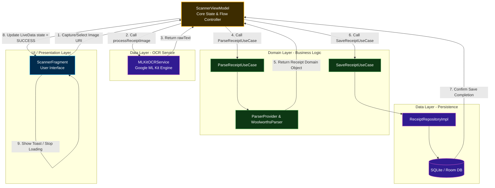

# NzReceiptApp 架構與資料流 (Architecture & Data Flow)

這份文件詳述了 **Scanner 掃描工作流** 的系統架構與組件間的互動流程。

## 掃描流程圖 (Scanning Workflow)

---

### 流程說明 (Step-by-Step Explanation)

1.  **UI 觸發**：使用者在 `ScannerFragment` 透過拍攝或相簿選取圖片，傳遞 URI 給 ViewModel。
2.  **啟動 OCR**：`ScannerViewModel` 呼叫 `MLKitOCRService`。
3.  **文字回傳**：Google ML Kit 辨識完成後回傳 `rawText`。
4.  **執行解析**：ViewModel 將文字交給 `ParseReceiptUseCase`。
5.  **領域轉換**：`WoolworthsParser` (或其他) 將文字轉化為 `Receipt` 領域物件。
6.  **執行儲存**：ViewModel 呼叫 `SaveReceiptUseCase` 啟動持久化流程。
7.  **寫入資料庫**：`ReceiptRepositoryImpl` 將領域物件轉為 Room Entity 並由 `ReceiptDao` 寫入 SQLite。
8.  **狀態更新**：成功後 ViewModel 更新 `state` LiveData。
9.  **UI 反饋**：Fragment 觀察到成功狀態，停止載入動畫並提示使用者。
