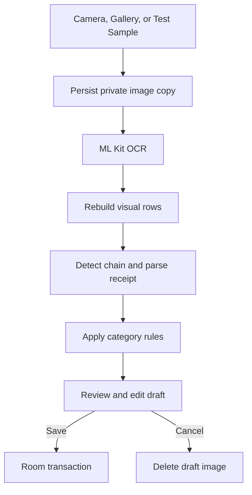
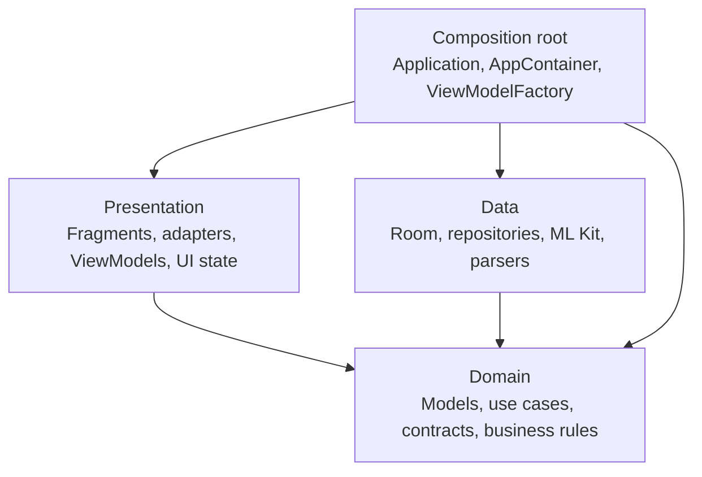
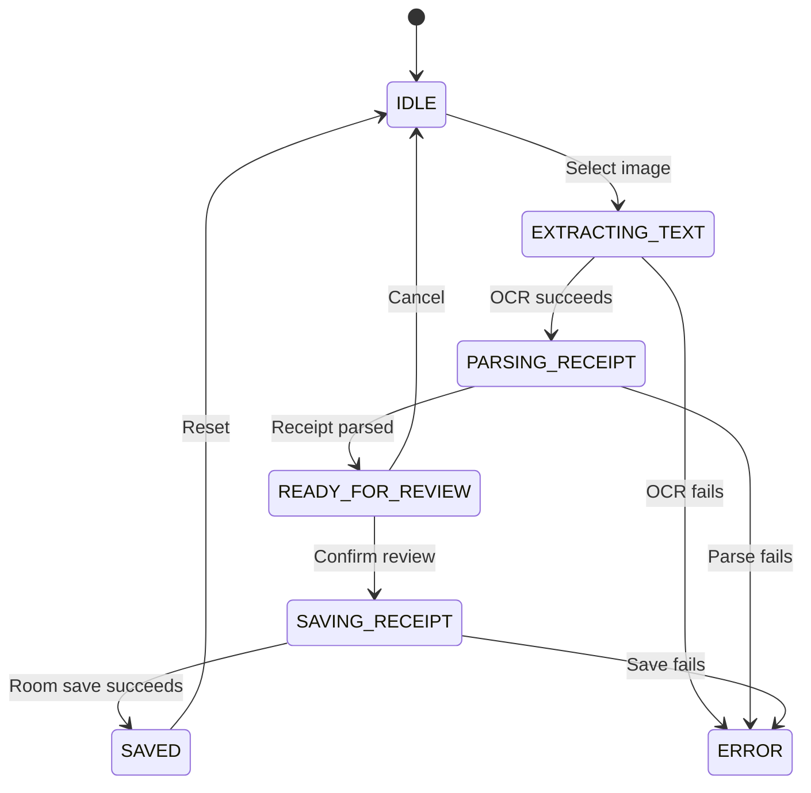
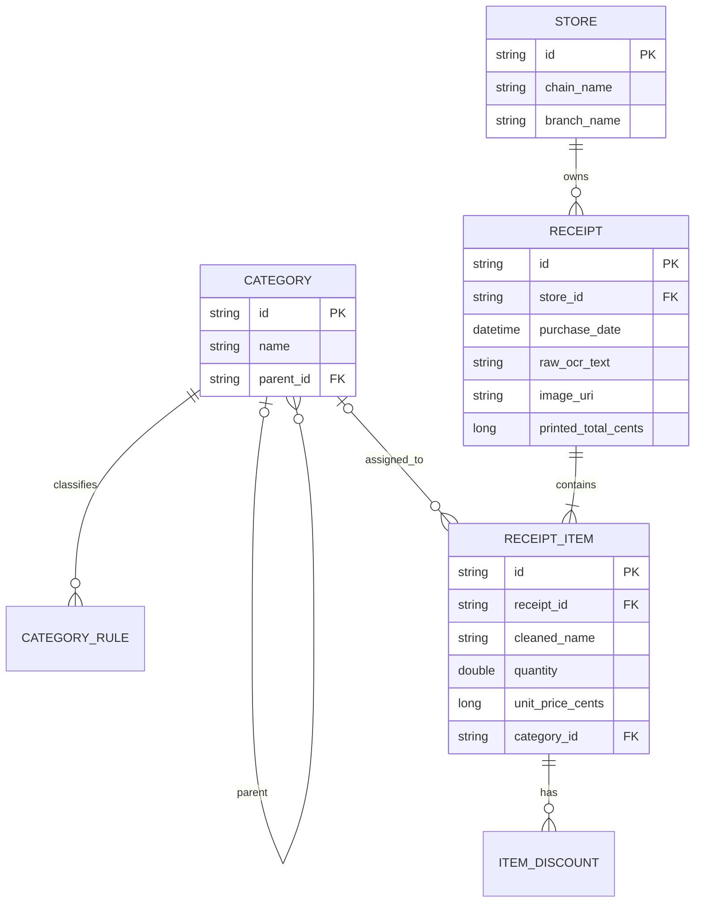

# NZ Receipt Expense Tracker

An Android learning project for turning New Zealand supermarket receipts into
reviewable, structured expense records. The app accepts a camera photo, gallery
image, or bundled test receipt; extracts text with Google ML Kit; reconstructs
receipt rows; parses supported supermarket formats; applies category rules; and
lets the user correct the result before saving it locally.

The project is written in Java and deliberately uses a small, explicit MVVM and
Clean Architecture structure so that a junior Android developer can trace each
user action from the UI to the database.

## Project goals

- Build a reliable receipt workflow before adding financial analytics.
- Keep OCR, parsing, classification, UI state, and persistence as separate
  responsibilities.
- Make OCR results reviewable instead of silently saving incorrect data.
- Keep business logic testable with ordinary JVM unit tests.
- Use the project to practise Android lifecycle, MVVM, Clean Architecture,
  Room, dependency injection, testing, and systems analysis.

## Current implementation status

| Capability | Status | Notes |
| --- | --- | --- |
| Camera capture | Implemented | CameraX rear-camera preview and capture |
| Gallery input | Implemented | Uses Android's content picker |
| Bundled Test Sample | Implemented | Uses `sample_woolworths.jpg` |
| OCR | Implemented | Google ML Kit Latin text recognition |
| OCR row reconstruction | Implemented | Rejoins name and price fragments by image coordinates |
| Woolworths / Countdown parser | Implemented | Rule-based parser with printed-total recognition |
| PAK'nSAVE parser | Implemented | Rule-based parser with printed-total recognition |
| Supermarket auto-detection | Implemented | Woolworths, Countdown, and PAK'nSAVE |
| Category rules | Implemented | Bundled two-level keyword rules stored in Room |
| Review before save | Implemented | Edit store, items, quantity, unit, price, and category |
| Local persistence | Implemented | Room database version 2 and app-private receipt images |
| Receipt history | Implemented | Receipt and all-item tabs with pagination and refresh |
| Receipt detail and deletion | Implemented | Deletion also removes the private image and unused store |
| Analytics business calculation | Partial | `GetAnalyticsUseCase` exists |
| Analytics screen | Not implemented | Bottom-navigation destination currently renders an empty view |
| New World / Four Square | Not implemented | No parser is registered for these chains |
| Cloud sync / export | Not implemented | `isSynced` exists, but no remote service is connected |

## Main user workflow

1. Open **Scanner**.
2. Select **Auto detect**, **Woolworths**, or **PAK'nSAVE** and optionally enter
   a branch.
3. Take a photo, choose an image from Gallery, or run **Test Sample**.
4. Wait for image persistence, OCR, layout reconstruction, parsing, and category
   classification.
5. Open **Review receipt**.
6. Correct store details and receipt items; add or remove items if necessary.
7. Compare the calculated item total with the printed total recognised from the
   receipt.
8. Save the reviewed receipt to Room, or cancel and discard the draft image.
9. Use **History** to browse receipts or all purchased items.



No receipt row is written to Room before the user confirms the review screen.

## Architecture

The app currently uses one Gradle module with package boundaries instead of
multiple Android modules. Dependencies point toward the `domain` layer.



| Layer | Responsibility | Examples |
| --- | --- | --- |
| `presentation` | Render state and forward user actions | `ScannerFragment`, `ScannerViewModel`, `ScannerUiState` |
| `domain` | Business models, use cases, and boundary contracts | `Receipt`, `ParseReceiptUseCase`, `IReceiptRepository` |
| `data` | Framework integrations and contract implementations | Room, ML Kit, parsers, repository implementations |
| `di` | Construct and connect dependencies | `AppContainer`, `ViewModelFactory` |

### Dependency rules

- `domain` must not import Android, Room, ML Kit, `data`, or `presentation`.
- Fragments must not create DAOs, repositories, or use cases.
- ViewModels coordinate use cases and expose observable UI state.
- `data` implements interfaces defined by `domain`.
- Concrete dependencies are connected only in `AppContainer` and
  `ViewModelFactory`.
- Background work uses the injected `Executor`, allowing unit tests to use
  `Runnable::run`.

See [docs/ARCHITECTURE.md](docs/ARCHITECTURE.md) for the package rules and
[docs/REFACTORING_PLAN.md](docs/REFACTORING_PLAN.md) for the staged roadmap.

## Scanner UI state

`ScannerUiState` is the single source of truth for the capture and review
workflow. It contains the phase, current draft, available categories, and error
message.



## Receipt processing responsibilities

| Step | Main class | Responsibility |
| --- | --- | --- |
| Capture/select | `ScannerFragment` | CameraX, gallery picker, test-sample click |
| Coordinate workflow | `ScannerViewModel` | Image → OCR → parse → review → save state |
| Store image | `LocalReceiptImageStore` | Copy input into app-private `receipt_images` |
| Extract text | `MLKitOCRService` | Run ML Kit and obtain positioned text lines |
| Rebuild rows | `OcrTextLayoutBuilder` | Group fragments by vertical position, then sort left-to-right |
| Select parser | `ParserProvider` | Detect chain and return a format-specific parser |
| Parse format | `WoolworthsParser`, `PakNSaveParser` | Convert receipt rows into items and printed total |
| Initialise categories | `BundledCategoryInitializer` | Load `category_rules.tsv` into Room once per app process |
| Classify items | `CategoryClassifier` | Apply longest matching keyword to each cleaned item name |
| Build draft | `ParseReceiptUseCase` | Combine store, parsed items, categories, OCR text, and image URI |
| Review | `ReceiptReviewFragment` | Let the user correct data and compare totals |
| Save/delete | `ReceiptRepositoryImpl` | Map domain objects to Room entities and manage stored images |

### Why the parser variable uses an interface

`ParseReceiptUseCase` depends on `IReceiptParser`, not directly on a concrete
parser:

```java
IReceiptParser parser = parserFactory.getParser(resolvedChain);
ParsedReceipt parsed = parser.parse(rawText);
```

At runtime, `ParserProvider` returns either `WoolworthsParser` or
`PakNSaveParser`. This keeps the use case independent of supermarket-specific
implementations and makes new parsers easier to add.

## Category classification

Default rules come from
[`app/src/main/assets/category_rules.tsv`](app/src/main/assets/category_rules.tsv):

```text
keyword    parent category    subcategory
milk       Food               Dairy & Eggs
chicken    Food               Meat
shampoo    Personal Care      Hair Care
```

The real file is tab-separated. During the first receipt parse in each app
process:

1. `BundledCategoryInitializer` reads the TSV asset.
2. Parent categories, subcategories, and keyword rules are inserted or reused
   in Room.
3. `CategoryClassifier` loads the rules through `ICategoryRepository`.
4. Item names are normalised and common units/symbols are removed.
5. The longest whole-keyword match wins.
6. The user may correct the category during review.

## Persistence model

Room database: `nz_receipt_db`

Current schema version: `2`



The full exported schema is version-controlled at
[`app/schemas/com.example.nzreceiptapp.data.local.AppDatabase/2.json`](app/schemas/com.example.nzreceiptapp.data.local.AppDatabase/2.json).
This file describes tables, columns, foreign keys, indexes, and Room's identity
hash; it contains no user receipts.

`MIGRATION_1_2` adds the raw OCR text, image URI, printed total, required indexes,
and a unique store chain/branch index. It also consolidates duplicate stores
before creating that unique index.

### Room schema rule

Whenever the database structure changes:

1. Increase the Room database version.
2. Add an explicit migration.
3. Build the app to generate the new schema JSON.
4. Commit the new schema file.
5. Add or update migration tests before release.

## Project structure

```text
app/src/main/java/com/example/nzreceiptapp/
├── MainActivity.java
├── NzReceiptApplication.java
├── di/
│   ├── AppContainer.java
│   └── ViewModelFactory.java
├── domain/
│   ├── logic/
│   ├── model/
│   ├── parser/
│   ├── repository/
│   ├── service/
│   └── usecase/
├── data/
│   ├── local/
│   ├── ocr/
│   ├── parser/
│   └── repository/
└── presentation/
    ├── adapter/
    ├── base/
    ├── view/
    └── viewmodel/
```

Additional important locations:

```text
app/src/main/assets/       Category rules and receipt samples
app/src/main/res/          Layouts, navigation, menus, strings, and themes
app/src/test/              Local JVM unit tests
app/schemas/               Version-controlled Room schema history
docs/                      Architecture and refactoring documentation
```

## Recommended code-reading order

For a developer new to Android, trace one user action instead of reading every
file alphabetically:

1. `MainActivity` — hosts the navigation graph and bottom navigation.
2. `nav_graph.xml` — connects Scanner, Review, History, Analytics, and Detail.
3. `fragment_scanner.xml` — declares the Scanner views.
4. `ScannerFragment` — binds click listeners and renders observable state.
5. `ScannerViewModel` — coordinates the receipt workflow.
6. `ScannerUiState` — defines the allowed UI phases and data.
7. `ParseReceiptUseCase` — performs the application-level parse action.
8. `ParserProvider` and a concrete parser — demonstrate runtime polymorphism.
9. `CategoryClassifier` — applies business classification rules.
10. `ReceiptRepositoryImpl` and `ReceiptDao` — map and persist the final receipt.
11. `AppContainer` and `ViewModelFactory` — show how all dependencies are built.
12. The matching test classes — show the intended behaviour in small examples.

## Technology stack

| Area | Technology |
| --- | --- |
| Language | Java, source/target compatibility 11 |
| UI | Android Views, XML layouts, View Binding, Material Components |
| Navigation | AndroidX Navigation Component |
| State | ViewModel and LiveData |
| Camera | CameraX |
| OCR | Google ML Kit Text Recognition |
| Persistence | Room 2.6.1 / SQLite |
| Concurrency | Injected Java `ExecutorService` |
| Unit testing | JUnit 4, Mockito, AndroidX Arch Core Testing |
| Build | Android Gradle Plugin 9.3.1, Gradle 9.6.1 |

Android configuration:

- Application ID: `com.example.nzreceiptapp`
- Minimum SDK: 26
- Target SDK: 36
- Compile SDK: Android 36, minor API 1
- Database version: 2

## Development setup

### Prerequisites

- Android Studio with its bundled JDK 17 or a compatible JDK
- Android SDK configured by Android Studio
- An emulator or Android device with API 26 or later
- Camera permission for camera capture
- Network access during the first Gradle sync

No OpenAI API key or paid API credit is required. Receipt OCR uses Google ML Kit,
and this project does not call the OpenAI API.

### Clone and open

```bash
git clone https://github.com/victorshih-nz/NZReceiptFinanceApp.git
cd NZReceiptFinanceApp
```

Open the repository root in Android Studio and allow Gradle Sync to finish. Use
the `app` run configuration and select an emulator or connected device.

If a copied worktree reports `SDK location not found`, create or copy the local
`local.properties` file through Android Studio. It normally contains a
machine-specific entry similar to:

```properties
sdk.dir=C\:\\Users\\YOUR_NAME\\AppData\\Local\\Android\\Sdk
```

Do not commit `local.properties`.

## Build and test

Run commands from the project root, where `gradlew.bat` is located.

### Windows PowerShell

```powershell
.\gradlew.bat clean testDebugUnitTest
.\gradlew.bat assembleDebug
```

### macOS or Linux

```bash
./gradlew clean testDebugUnitTest
./gradlew assembleDebug
```

`testDebugUnitTest` runs the local JVM suite without launching an emulator. The
current suite contains 31 tests covering:

- OCR row reconstruction
- parser selection and supermarket detection
- Woolworths and PAK'nSAVE parsing
- category keyword matching
- parse, save, delete, and analytics use cases
- repository mapping and image cleanup
- Scanner, History, and Receipt Detail ViewModels

Open the generated HTML report at:

```text
app/build/reports/tests/testDebugUnitTest/index.html
```

`assembleDebug` compiles resources and Java code, runs annotation processing and
View Binding generation, and creates a debug APK under:

```text
app/build/outputs/apk/debug/
```

## Manual test checklist

### Test Sample workflow

1. Run `MainActivity` on an emulator or device.
2. On Scanner, leave the chain as **Auto detect**.
3. Tap **Test Sample**.
4. Confirm the status progresses through OCR and parsing.
5. Tap **Review receipt**.
6. Check store, items, categories, calculated total, and printed total warning.
7. Edit one item and save.
8. Open History and verify the receipt and item views.
9. Open the receipt detail.
10. Delete the receipt and confirm it disappears.

### Camera and Gallery workflow

- Capture a clear, straight receipt in good lighting.
- Select an existing receipt from Gallery.
- Test both Auto detect and an explicitly selected chain.
- Cancel one draft and confirm it is not added to History.
- Test an unsupported or unreadable image and confirm an error is shown.

## Sample assets

- `sample_woolworths.jpg` is the file used by the **Test Sample** button.
- Asset names are case-sensitive: `.jpg` and `.JPG` are different paths.
- Only edit source assets under `app/src/main/assets`.
- Files under `app/build/intermediates` are generated build output and must not be
  edited.

The other bundled images are retained as development fixtures but are not
currently connected to a separate UI button.

## Common troubleshooting

### `Failed to load sample from assets`

Confirm this exact source file exists:

```text
app/src/main/assets/sample_woolworths.jpg
```

Then clean, rebuild, and reinstall the app.

### `No tests found for given includes`

First run the complete suite:

```powershell
.\gradlew.bat testDebugUnitTest
```

For one test class, the package and class name must match the source exactly:

```powershell
.\gradlew.bat testDebugUnitTest --tests "com.example.nzreceiptapp.data.parser.ParserProviderTest"
```

### `SDK location not found`

Open the project in Android Studio or add the correct `sdk.dir` to the untracked
`local.properties` file.

### Embedded emulator appears black

Try opening the emulator in a standalone window or use Device Manager **Cold
Boot Now**. A black embedded Running Devices panel can be an emulator rendering
problem rather than an application crash. Confirm the app process and Logcat
before changing layouts.

### Resource merge fails after XML changes

Inspect the first resource error, then run:

```powershell
.\gradlew.bat clean assembleDebug --stacktrace
```

Generated `app/build` resources should not be edited or committed.

## Known limitations

- Receipt parsing is deterministic and format-specific; supermarket receipt
  layouts can change.
- OCR accuracy depends heavily on focus, lighting, rotation, and receipt
  condition.
- The purchase date currently defaults to processing time instead of parsing the
  printed receipt date.
- Printed-total recognition is incomplete for some OCR layouts.
- The review screen is required because parser output is not guaranteed to be
  financially accurate.
- History still uses separate loading, error, data, mode, and page LiveData
  fields instead of one immutable UI state.
- History pagination does not yet know when the final page has been reached.
- Toast errors are not modelled as one-time UI events.
- Analytics has a domain calculation but no ViewModel or rendered screen.
- There are no GitHub Actions checks, instrumentation tests, or automated Room
  migration tests yet.

## Roadmap

Recommended next priorities:

1. Add real anonymised receipt fixtures and parser regression tests.
2. Separate OCR warnings, parser warnings, and validation failures.
3. Add receipt-date recognition and explicit validation rules.
4. Introduce one immutable `HistoryUiState` and bounded pagination.
5. Add Room migration and repository integration tests.
6. Implement Analytics with a domain result model, ViewModel, and UI.
7. Add New World and Four Square behind `IReceiptParser`.
8. Add export/backup and later cloud sync behind new domain contracts.
9. Add GitHub Actions for unit tests and debug builds.

## Privacy and data handling

- Receipt images are copied into app-private storage before OCR.
- Saved receipts retain the private image URI and raw OCR text for review and
  future reprocessing.
- Cancelling a draft deletes its private image copy.
- Deleting a receipt deletes its database records, private image, and unused
  store row.
- The app has no application backend and does not upload receipt data to the
  OpenAI API.

## Contributing safely

Before committing a change:

1. Keep unrelated Android Studio files out of the commit.
2. Check `git status` and stage explicit paths.
3. Add or update the smallest relevant unit tests.
4. Run `testDebugUnitTest` and `assembleDebug`.
5. Manually test the affected user workflow.
6. Commit Room schema JSON whenever the database version changes.
7. Update this README or the architecture documentation when behaviour or
   boundaries change.

## Documentation

- [System Analysis documentation set](docs/system-analysis/README.md)
- [Architecture guide](docs/ARCHITECTURE.md)
- [Refactoring plan](docs/REFACTORING_PLAN.md)

The System Analysis set provides the formal context, scope, actors, functional
and non-functional requirements, use cases, data dictionary, sequence diagrams,
business rules, traceability, risks, assumptions, decisions, acceptance tests,
roadmap, and a catalogue of every production Java component.
