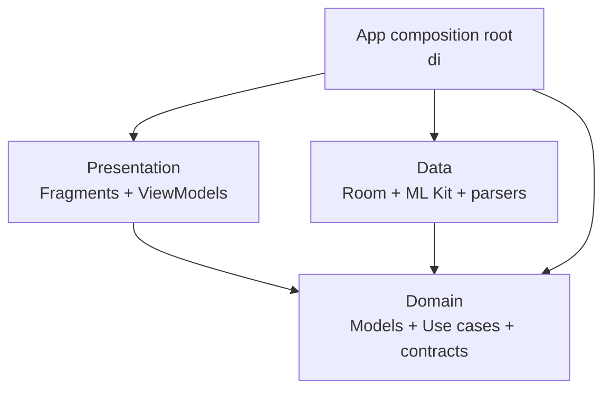

# Architecture guide

## Goal

Keep Android details at the edge of the application so receipt parsing, expense
rules, and use cases remain easy to understand and test.

## Dependency rule

Dependencies point toward `domain`:



`domain` must not import `android.*`, `androidx.*`, `data`, or `presentation`.

## Package ownership

| Package | Owns | Must not own |
| --- | --- | --- |
| `domain/model` | Business entities and value objects | Room annotations, UI formatting |
| `domain/usecase` | One user/business action | Android lifecycle or threading |
| `domain/repository`, `domain/service`, `domain/parser` | Boundary contracts | Concrete frameworks |
| `data/local` | Room database, DAOs, and database entities | UI state |
| `data/repository` | Mapping and contract implementations | Fragment/ViewModel references |
| `data/ocr`, `data/parser` | External and format-specific implementations | Screen navigation |
| `presentation/viewmodel` | Screen state and orchestration | Room DAOs or concrete repositories |
| `presentation/view` | Rendering and user interactions | Data access and business rules |
| `di` | Construction and dependency wiring | Business logic |

## Screen flow

For a normal data-backed screen:

```text
Fragment -> ViewModel -> UseCase -> Repository contract
                                      ^
                                      |
                              Repository implementation -> DAO
```

The Fragment observes state and sends user actions to the ViewModel. It does not
create a database, repository, use case, or background thread.

## Adding a feature

1. Define or extend the domain model and repository contract.
2. Add a focused use case if the action has business meaning.
3. Implement data access and mapping behind the contract.
4. Expose screen state and actions from a ViewModel.
5. Render state in the Fragment.
6. Wire the new dependency only in `AppContainer` and `ViewModelFactory`.
7. Add domain/use-case tests first, then ViewModel tests.

## Deliberate choices

- Keep one Gradle module while the app is small. Package boundaries provide the
  useful separation without multi-module build overhead.
- Keep use cases synchronous. The presentation layer supplies an injected Java
  `Executor`, so unit tests can use `Runnable::run` without sleeps.
- Keep Room models separate from domain models. Mapping stays inside repository
  implementations.
