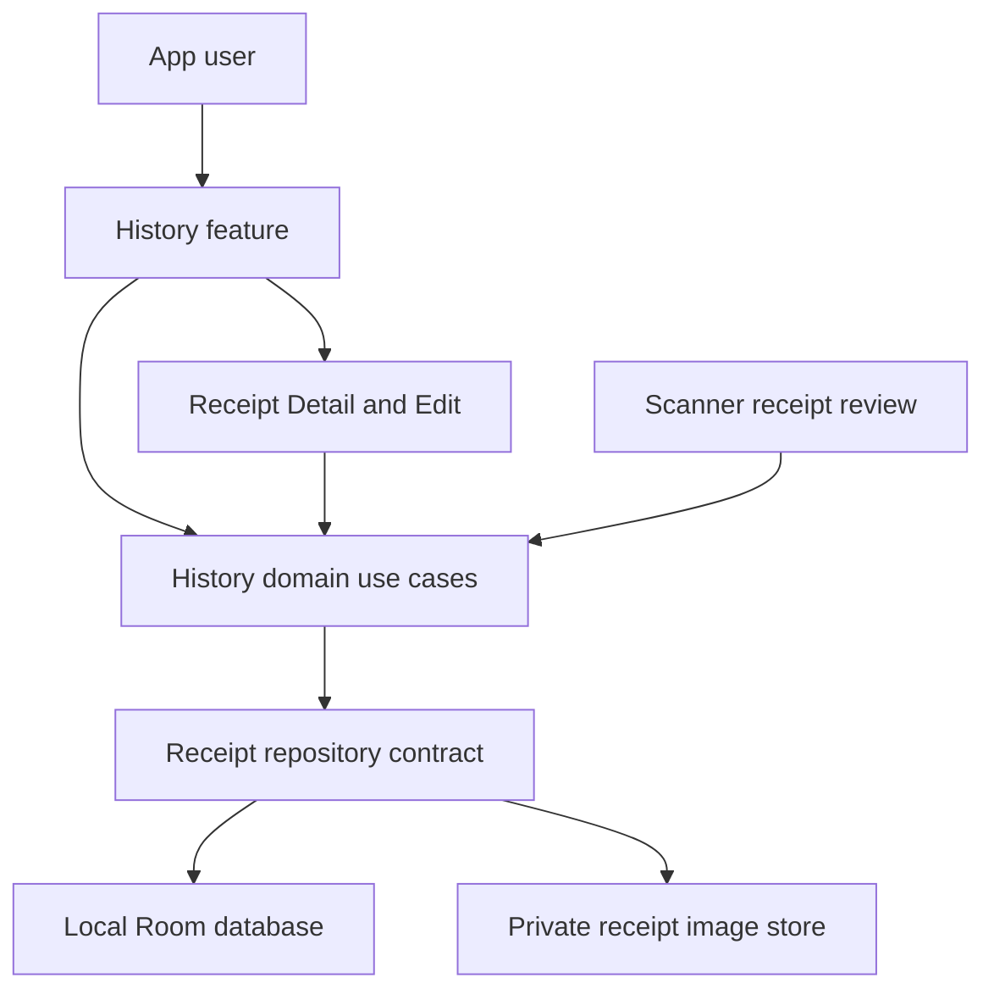

# History Feature Scope

## 1. Document control

| Field | Value |
| --- | --- |
| Feature ID | `HIS` |
| Feature name | History Completion v1 |
| Document ID | `HIS-SCP-01` |
| Repository source | `01-feature-scope.md` |
| Version | 0.9 |
| Status | Approved for requirements analysis |
| Date | 2026-08-17 |
| Author | Victor Shih — Systems Analyst |
| Product | NZ Receipt Expense Tracker |
| Code baseline | `main` at `5fd0fbd` |

### 1.1 Revision history

| Version | Date | Author | Change |
| --- | --- | --- | --- |
| 0.1 | 2026-08-17 | Victor Shih | Initial scope based on the current History implementation |
| 0.2 | 2026-08-17 | Victor Shih | Approved scope decisions; added receipt editing, per-tab paging state, selectable page size, and direct page selection |
| 0.3 | 2026-08-17 | Victor Shih | Defined FIFO tie ordering, non-negative totals, and best-effort receipt-image cleanup after database deletion |
| 0.4 | 2026-08-17 | Victor Shih | Added duplicate-receipt confirmation, normalized Chain comparison, full purchase-timestamp ordering, and invalid-page recovery after Refresh |
| 0.5 | 2026-08-17 | Victor Shih | Unified timestamp source, storage, ordering, duplicate-hour comparison, History display, and editable Scanner Review date/time |
| 0.6 | 2026-08-17 | Victor Shih | Defined normalized Chain-and-Branch Store identity and empty-Branch equivalence |
| 0.7 | 2026-08-17 | Victor Shih | Renamed duplicate confirmation actions to Discard/Add and defined Discard as no insertion with Review retained |
| 0.8 | 2026-08-17 | Victor Shih | Finalised duplicate dialog title and message as `Possible duplicate receipt` / `Add anyway?` |
| 0.9 | 2026-08-17 | Victor Shih | Revised Chain and Branch comparison keys to retain ASCII letters and digits only, ignoring spaces and punctuation |

## 2. Purpose

This document defines the product and system boundary for completing the History
feature. It establishes what the History Completion v1 change will achieve, what
it will preserve, and what it will not include.

Detailed functional requirements, use cases, business rules, UI behaviour, and
acceptance tests will be defined in documents 02–06 after this scope is approved.

## 3. Background and problem statement

The app already allows a user to browse saved receipts and purchased items,
refresh results, move between pages, open receipt details, and delete a receipt.
However, the current implementation is not yet a complete and predictable user
experience:

- the user can navigate beyond the final page and reach an unnecessary empty
  page;
- History screen state is split across multiple observable fields, so loading,
  content, empty, error, page, and selected-tab values can become inconsistent;
- opening the screen or selecting a tab can trigger duplicate loads;
- a successful-deletion message is displayed before deletion has actually
  succeeded;
- deletion has no confirmation step;
- deletion, final-page, loading, empty, and failure scenarios have incomplete
  automated coverage;
- the page size is fixed and the user cannot directly select a valid page;
- the user can inspect a saved receipt but cannot correct it after saving;
- initial save does not detect a potentially duplicated Receipt;
- Scanner currently assigns the scan-time clock value rather than extracting
  the printed receipt purchase timestamp;
- several labels and messages remain hard-coded in Java or layout files.

The feature therefore needs completion and stabilisation before search, filters,
analytics, or other advanced history capabilities are introduced.

## 4. Feature goal

Provide a reliable History page where a user can browse saved receipts and
purchased items, understand the current screen state, choose a useful page size,
navigate directly to any valid page, inspect or correct a saved receipt, and
deliberately delete a receipt with accurate success or failure feedback.

## 5. Business and user outcomes

| ID | Outcome |
| --- | --- |
| `OUT-HIS-01` | Users can find recently saved receipts and items without encountering invalid pages. |
| `OUT-HIS-02` | Users can distinguish loading, content, empty, and failure states. |
| `OUT-HIS-03` | Users do not accidentally delete a receipt without confirmation. |
| `OUT-HIS-04` | Users receive a success message only after deletion succeeds and a failure message when it does not. |
| `OUT-HIS-05` | History behaviour remains predictable after refresh, tab changes, page changes, and deletion. |
| `OUT-HIS-06` | Developers can maintain and test History through one immutable UI state and explicit one-time effects. |
| `OUT-HIS-07` | Users can choose how many records are displayed and return to the previous page position in each tab. |
| `OUT-HIS-08` | Users can correct a saved receipt without creating a duplicate receipt. |
| `OUT-HIS-09` | Users are warned before intentionally or accidentally adding a Receipt that matches an existing Receipt's approved duplicate key. |

## 6. Stakeholders and actors

| Stakeholder / actor | Interest or responsibility |
| --- | --- |
| App user | Browse, inspect, refresh, and delete personal receipt history safely. |
| Product owner | Decide feature priority, user-visible behaviour, and accepted scope. |
| Systems analyst | Define requirements, rules, exception flows, UI states, and traceability. |
| Android developer | Implement the approved behaviour within MVVM and Clean Architecture boundaries. |
| Tester | Verify requirements, state transitions, paging boundaries, deletion, and regression behaviour. |
| Maintainer | Keep documentation, code, tests, and Room behaviour consistent over time. |

The app user is the only primary external actor in History Completion v1.

## 7. Current capability baseline

The following behaviour already exists and must be retained unless a later
approved requirement explicitly changes it.

| Existing capability | Current behaviour |
| --- | --- |
| Receipt history | Displays saved receipts newest-first, 10 records per page; current code renders date and time to minutes. |
| All Items history | Displays purchased items newest-first, 25 records per page. |
| Tabs | Receipts and All Items modes are available. |
| Pagination | Previous and Next buttons change the current page. |
| Refresh | Pull-to-refresh reloads the selected mode and page. |
| Receipt summary | Shows chain, branch, purchase date, item count, and final payable total. |
| Item summary | Shows item name, chain, purchase date, category, and final subtotal. |
| Receipt detail | Selecting a receipt navigates to its saved detail screen. |
| Empty result | An empty message is displayed when the returned list is empty. |
| Deletion | A receipt can be deleted from the receipt list. |
| Related cleanup | Items and discounts cascade; the unused Store is removed and private-image deletion is attempted. |
| Data source | History is read from the local Room database without an account or backend. |

## 8. In scope

History Completion v1 includes the following capabilities.

### 8.1 Browse and display

- retain Receipts and All Items modes;
- order by the stored purchase timestamp, including hours, minutes, and seconds,
  from newest to oldest;
- keep the existing History Receipt timestamp display through minutes;
- retain the current receipt and item summary information;
- preserve navigation from a receipt summary to Receipt Detail;
- provide mutually consistent loading, content, empty, and error presentation;
- retain pull-to-refresh for the currently selected history view.

### 8.2 Predictable paging

- use a default page size of 15 records for Receipts and 30 records for All
  Items;
- allow the user to select 15, 30, or 50 records per page in either mode;
- reset the affected mode to page 1 when its page size changes;
- remember each mode's current page and page size independently while the
  History ViewModel remains active;
- determine total records, total pages, and whether previous/next pages exist;
- allow the user to select any valid page directly;
- disable Previous on the first page;
- disable Next on the final page;
- prevent navigation to a page known to be invalid;
- automatically load the previous valid page when deletion empties a non-first
  page.
- after Refresh, load the last valid page when the previously selected page no
  longer exists.

### 8.3 Safe deletion

- request user confirmation before permanent deletion;
- execute deletion through the existing domain use case and repository boundary;
- preserve existing cascading database cleanup and attempt private-image cleanup;
- treat successful database deletion as deletion success even if private-image
  cleanup fails;
- show failure feedback without falsely reporting success;
- reload or reposition the current page after successful deletion according to
  the approved business rule;
- do not provide Undo or recovery after a confirmed permanent deletion.

### 8.4 Edit saved receipt

- allow the user to start editing from Receipt Detail;
- load the existing receipt into the receipt review/edit experience without
  creating a second receipt;
- allow editing of chain, branch, purchase date, item name, quantity, unit,
  price, and category;
- allow items to be added to or removed from the saved receipt;
- apply the same receipt and item validation rules used before an initial save;
- preserve receipt identity and update the aggregate in one transaction;
- reuse one Store when normalized Chain and Branch identity values match;
  normalization retains ASCII letters and digits only, converts letters to
  lowercase, and treats `null`, empty, whitespace-only, and
  non-alphanumeric-only Branch as the same empty identity value;
- keep raw OCR text, recognised printed total, and receipt image read-only;
- return to the updated Receipt Detail after a successful update;
- show accurate update success or failure feedback.

### 8.5 Duplicate receipt detection before initial save

- before inserting a new Receipt, search for an existing Receipt with the same
  normalized Chain, purchase date and hour, and final payable total;
- normalize Chain for comparison by removing every character except ASCII
  letters and digits, then converting letters to lowercase;
- use a purchase date/time parsed from the receipt as the preferred timestamp;
- when the Parser cannot recognise a purchase time, use the capture-time local
  `LocalDateTime.now()` value as the fallback;
- allow the user to review and edit both purchase date and time before initial
  save;
- when a match exists, show `Possible duplicate receipt` and ask `Add anyway?`
  with Discard and Add actions;
- save a second Receipt only when the user selects Add;
- when the user selects Discard, do not insert another Receipt and keep the reviewed
  draft available;
- do not treat updating an existing Receipt under the same Receipt ID as an
  initial duplicate-add operation.

### 8.6 Presentation-state refactoring

- introduce one immutable `HistoryUiState` as the screen's state source;
- represent selected mode, each mode's page and page size, total records, total
  pages, records, paging availability, loading status, and screen error
  consistently;
- introduce one-time effects for user messages and other actions that must not be
  replayed as persistent screen state;
- prevent duplicate initial loads and avoid stale results replacing the active
  mode or page;
- show a dedicated History-content error state with Retry when the initial load
  fails and no previous data exists;
- retain existing data and show a one-time error message when refresh fails;
- move History user-facing text into Android string resources.

### 8.7 Verification and documentation

- add or update ViewModel and domain unit tests for approved History behaviour;
- define manual acceptance tests for the user-visible workflow;
- update architecture and traceability documentation affected by the change;
- preserve MVVM and Clean Architecture dependency rules.

## 9. Out of scope

The following capabilities are excluded from History Completion v1:

- receipt scanning, OCR reconstruction, parsing, classification, and review,
  except the purchase-timestamp capture/review and duplicate-check changes
  explicitly required by this scope;
- replacing the saved receipt image or running OCR/parser processing again while
  editing;
- Analytics screens or category-spending charts;
- category-rule management;
- cloud synchronisation, accounts, backup, or multi-device history;
- export, import, printing, or sharing receipts;
- New World or Four Square parser support;
- infinite scrolling;
- Room schema changes, except the minimum saved-order persistence required for
  deterministic FIFO ordering when purchase timestamps are equal;
- advanced search, free-text query, date-range filter, supermarket filter,
  category filter, and alternate sort orders;
- deletion Undo or recovery after confirmed permanent deletion.

Search/filter/sort and deletion Undo are candidate future enhancements.

## 10. System boundary

### 10.1 Inside the feature boundary

- History Fragment and XML layout;
- History adapters;
- History ViewModel, UI state, and one-time effects;
- Receipt Detail changes needed to start editing;
- the reusable receipt review/edit presentation;
- paged history, deletion, receipt update, and validation use cases;
- duplicate-receipt lookup and confirmation before initial save;
- repository/DAO paging contract changes needed to return counts and valid page
  information;
- repository/DAO transaction changes needed to update the saved receipt
  aggregate and clean up an unused previous Store;
- History-related resources, unit tests, and acceptance tests.

### 10.2 Interacting systems outside the feature boundary

- Room remains the local persistence mechanism;
- the image store remains responsible for attempting deletion of app-owned
  receipt images after database deletion;
- Scanner remains responsible for image acquisition, OCR, and initial receipt
  creation;
- Analytics may consume saved data later but is not changed by this feature.

## 11. Dependencies

| Dependency | Why History depends on it |
| --- | --- |
| Saved receipt data | History cannot display records until Scanner/Review has saved them. |
| `IReceiptRepository` | Provides paged reads, total counts, receipt update, and receipt deletion. |
| Duplicate-receipt lookup | Checks normalized Chain, purchase date/hour, and final payable total before initial insertion. |
| Receipt Parser and Scanner Review | Prefer parsed receipt purchase date/time, carry capture-time fallback, and allow date/time correction before initial save. |
| Room and `ReceiptDao` | Provide ordered queries, counts, and transactional update/deletion. |
| `IReceiptImageStore` | Attempts best-effort deletion of the private image after a saved receipt is removed. |
| Receipt Detail navigation | Receives the selected `receiptId` and starts the edit flow. |
| Receipt review and validation | Supplies reusable edit fields and validation behaviour without coupling History to Scanner presentation logic. |
| AppContainer / ViewModelFactory | Supply use cases and the background executor. |
| Android lifecycle components | Retain and observe History state safely. |

## 12. Constraints

- The project remains Java-based and uses Android Views, View Binding,
  ViewModel, and LiveData.
- The feature must preserve MVVM and Clean Architecture dependency direction.
- The domain layer must remain free of Android, Room, and presentation imports.
- Database and file operations must not run on the main UI thread.
- Existing saved data must remain readable, editable, and deletable.
- The purchase timestamp is persisted at second precision; History displays it
  through minutes while ordering may use seconds.
- Updating a receipt must retain the same receipt ID and must not create a
  duplicate receipt.
- The update must be atomic across Store, Receipt, Receipt Items, Discounts, and
  category references.
- Monetary values remain integer cents.
- Core History remains local-first and must not require network access.
- The minimum supported Android API remains 26.
- User-visible behaviour must be testable through deterministic ViewModel/domain
  tests where Android framework behaviour is not required.

## 13. Assumptions

The following approved assumptions guide requirements analysis:

- History Completion v1 improves the existing two-tab page instead of replacing
  it with a new navigation model.
- Receipts and All Items continue to use button-based pagination.
- Permanent deletion requires explicit confirmation.
- Search and filters can be deferred without preventing the core History goal.
- Existing saved data remains compatible; one minimal saved-order field or an
  equivalent stable persisted sequence may be added for FIFO tie ordering.
- Receipt editing reuses domain validation and review components, but History
  does not call Scanner ViewModel save logic.
- Page and page-size selections are retained per mode only while the History
  ViewModel remains active; they are not persisted across an app restart.
- Raw OCR text, printed total, and receipt image remain read-only during editing.

An invalid assumption must result in a scope revision before implementation.

## 14. High-level success criteria

History Completion v1 is successful when:

1. the user can browse both History modes without navigating beyond the final
   page;
2. the user can select 15, 30, or 50 records per page and can directly select any
   valid page;
3. each mode retains its own page and page-size selection while History state is
   active;
4. Previous and Next accurately reflect page availability;
5. exactly one clear loading, content, empty, or failure presentation is active
   for the selected mode and page;
6. an initial-load failure shows Retry, while a refresh failure retains existing
   data;
7. opening the screen and changing tabs do not produce unintended duplicate
   loads;
8. deletion requires confirmation and provides no Undo after confirmed deletion;
9. deletion success is reported after the required database deletion succeeds;
   private-image cleanup failure does not restore or redisplay the deleted
   receipt;
10. database deletion failure retains a truthful screen state and does not show
    success;
11. deleting the last record on a non-first page loads the previous valid page;
12. the user can edit all approved receipt fields, add or remove items, and save
    the changes to the same receipt ID;
13. a successful update returns to the updated Receipt Detail, while an update
    failure does not falsely report success;
14. existing stored receipt compatibility is preserved;
15. every approved `FR-HIS` requirement traces to at least one automated or
    manual acceptance test.
16. initial save warns before adding a Receipt whose normalized Chain, purchase
    date/hour, and final payable total match an existing Receipt;
17. Refresh never leaves the user on a page beyond the refreshed final page.
18. parsed receipt date/time is preferred, capture-time `LocalDateTime.now()` is
    used only when parsing does not provide it, and Scanner Review permits
    date/time correction before save.

Exact measurable acceptance examples will be defined in
`06-acceptance-tests.md`.

## 15. Planned analysis and delivery artefacts

| Document | Purpose |
| --- | --- |
| `01-feature-scope.md` | Define the goal, boundary, stakeholders, inclusions, and exclusions. |
| `02-functional-requirements.md` | Define uniquely identified and testable system requirements. |
| `03-use-cases.md` | Define main, alternate, and exception user/system flows. |
| `04-business-rules.md` | Define paging, ordering, deletion, totals, and state-independent rules. |
| `05-ui-specification.md` | Define layout, content, controls, states, messages, and interactions. |
| `06-acceptance-tests.md` | Define Given/When/Then evidence and requirement traceability. |

Implementation begins only after the six documents are consistent and the
Must-priority requirements are approved.

## 16. Approved scope decisions

| ID | Approved decision |
| --- | --- |
| `OSD-HIS-01` | Search, date, Store, and Category filters are deferred. |
| `OSD-HIS-02` | Confirmed permanent deletion does not provide Undo. |
| `OSD-HIS-03` | Receipts and All Items independently remember page and page-size selections while History state remains active. |
| `OSD-HIS-04` | Deleting the last record from a non-first page automatically loads the previous valid page. |
| `OSD-HIS-05` | A refresh failure keeps existing records visible and produces a one-time error message. |
| `OSD-HIS-06` | An initial-load failure with no existing records shows a History-content error state and Retry action. |
| `OSD-HIS-07` | Receipt Detail supports editing; approved fields use shared review validation and update the same receipt ID. |
| `OSD-HIS-08` | Both modes offer page sizes 15, 30, and 50; defaults are 15 Receipts and 30 All Items. |
| `OSD-HIS-09` | The user can directly select any valid page and load that page's content. |
| `OSD-HIS-10` | When Receipts have the same purchase date and time, the Receipt saved first is displayed first (FIFO); the minimum persistence change needed to retain this order is permitted. |
| `OSD-HIS-11` | A negative item final subtotal or Receipt final payable total is invalid; initial save and update are blocked and validation feedback is shown. |
| `OSD-HIS-12` | Database deletion is the required deletion outcome. Private-image deletion is best-effort; its failure does not block success and orphan-image cleanup is deferred to a future maintenance feature. |
| `OSD-HIS-13` | Chain is required for initial save and update; `null`, empty, or whitespace-only Chain is invalid and the Chain input area is highlighted in red. Branch remains optional. |
| `OSD-HIS-14` | Before initial save, normalized Chain, purchase calendar date and hour, and final payable total identify a potential duplicate; minutes, seconds, and fractional seconds are ignored. A match displays `Possible duplicate receipt` / `Add anyway?`; Add inserts, while Discard performs no insertion and retains Review. |
| `OSD-HIS-15` | If Refresh reduces the available pages below the retained current page, the system automatically loads the new final valid page. |
| `OSD-HIS-16` | Chain comparison removes every character except ASCII letters and digits and converts letters to lowercase, while user-facing display text retains its approved presentation format. |
| `OSD-HIS-17` | The Parser-recognised receipt purchase date/time is the preferred timestamp. If unavailable, the capture-time local `LocalDateTime.now()` value is used. |
| `OSD-HIS-18` | Scanner Receipt Review displays and allows editing of both purchase date and purchase time before initial save. |
| `OSD-HIS-19` | History keeps its current purchase timestamp presentation through minutes; the display does not control the greater precision used for sorting. |
| `OSD-HIS-20` | Store identity compares lowercase ASCII-alphanumeric-only Chain and Branch keys. Spaces and punctuation are removed; `null`, empty, whitespace-only, and non-alphanumeric-only Branch values are equivalent. |

## 17. Approval

| Role | Name | Decision | Date |
| --- | --- | --- | --- |
| Product owner | Victor Shih | Scope decisions approved | 2026-08-17 |
| Systems analyst | Victor Shih | Approved for requirements analysis | 2026-08-17 |
| Developer |  | Pending technical review |  |
| Tester |  | Pending testability review |  |
