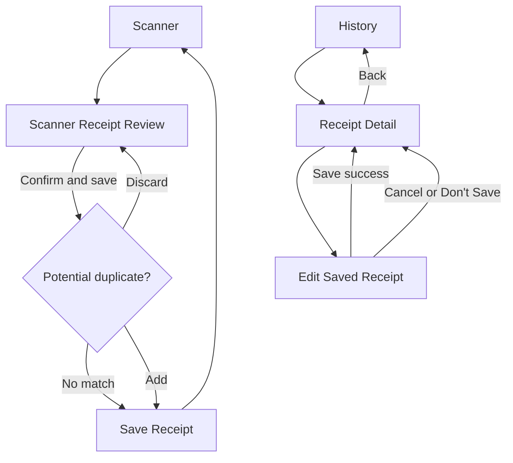

# History UI Specification

## 1. Document control

| Field | Value |
| --- | --- |
| Feature ID | `HIS` |
| Feature name | History Completion v1 |
| Document ID | `HIS-UIS-05` |
| Repository source | `05-ui-specification.md` |
| Version | 0.4 |
| Status | Draft for review |
| Date | 2026-08-17 |
| Author | Victor Shih — Systems Analyst |
| Source scope | `HIS-SCP-01`, version 0.8 |
| Source requirements | `HIS-FRS-02`, version 0.9 |
| Source use cases | `HIS-UCS-03`, version 0.8 |
| Source business rules | `HIS-BRS-04`, version 0.7 |
| Code baseline | `main` at `5fd0fbd` |

### 1.1 Revision history

| Version | Date | Author | Change |
| --- | --- | --- | --- |
| 0.1 | 2026-08-17 | Victor Shih | Initial UI specification derived from approved History scope, requirements, use cases, and business rules |
| 0.2 | 2026-08-17 | Victor Shih | Approved direct-page Dropdown, Snackbar effects, Review second editing, and blank Branch presentation; revised duplicate-dialog copy and retained timestamp-source helper and `Del` semantics for clarification |
| 0.3 | 2026-08-17 | Victor Shih | Removed timestamp-source helper and approved Discard/Add duplicate actions; Discard performs no insertion and retains the Review draft |
| 0.4 | 2026-08-17 | Victor Shih | Finalised duplicate dialog title `Possible duplicate receipt` and message `Add anyway?` |

## 2. Purpose

This document defines the screens, controls, content, visual states,
interactions, validation presentation, dialogs, and user-facing messages for
History Completion v1. It specifies what the user must see and be able to do
without prescribing final Fragment, ViewModel, adapter, or Room implementation.

The specification covers History and the connected Receipt Detail, saved-
Receipt Edit, and Scanner Receipt Review changes required by the approved
feature. Given/When/Then test evidence will be defined in
`06-acceptance-tests.md`.

## 3. UI principles and conventions

### 3.1 General principles

- The active screen must have one understandable presentation: Loading,
  Content, Empty, or Error.
- Existing successful content remains visible during Refresh, page change, and
  recoverable operation failures.
- A disabled action must appear disabled and must not respond to input.
- Red error styling must always be accompanied by readable error text; colour
  alone must not communicate an error.
- Persistent screen state must not be represented only by Toast or Snackbar.
- Success, failure, confirmation, and navigation effects occur once and must
  not replay after lifecycle recreation.
- All user-facing text belongs in Android string resources.
- Monetary values display in NZ-dollar style with two decimal places, such as
  `$95.00`, while domain and persistence values remain integer cents.
- Receipt summaries and Receipt Detail display purchase timestamps as
  `yyyy-MM-dd HH:mm`; All Items summaries retain their current `yyyy-MM-dd`
  purchase-date presentation.
- Controls must support the project minimum API 26 and normal small-phone
  portrait layouts without clipping the bottom actions.

### 3.2 Accessibility

- Interactive controls have a minimum 48 dp touch target.
- Icon-only actions have a meaningful content description.
- Screen-reader traversal follows visible top-to-bottom order.
- Error text is associated with its input and announced when validation runs.
- Focus moves to the first invalid field after an attempted save/update.
- Text and interactive elements use theme colours with accessible contrast.
- Loading indicators expose a meaningful state description and do not trap
  focus.

### 3.3 Terminology and casing

| UI term | Meaning |
| --- | --- |
| Receipts | History mode containing one summary per saved Receipt. |
| All Items | History mode containing purchased-item summaries across Receipts. |
| Chain | Supermarket chain shown to the user with presentation casing preserved. |
| Branch | Optional supermarket location. |
| Page size | Maximum records requested for one page: 15, 30, or 50. |
| Purchase date/time | Receipt purchase timestamp used for display and chronological ordering. |
| Calculated total | Final payable total calculated from items and discounts. |
| Printed total | Total recognised from the receipt image; it may be unavailable. |

## 4. Screen and navigation map



### 4.1 Screen inventory

| Screen / surface | Purpose | Existing baseline | Required change |
| --- | --- | --- | --- |
| History | Browse Receipts and All Items with predictable state and paging. | Two tabs, list, pull-to-refresh, Prev/Next, and `Page 1`. | Unified states, counts/pages, page-size and direct-page selectors, confirmation, Retry, and accurate effects. |
| Receipt Detail | Inspect one saved Receipt. | Chain, Branch, timestamp, items, and total. | Add Edit action and complete load/error behaviour. |
| Edit Saved Receipt | Correct an existing Receipt without creating another ID. | Not implemented. | Reuse approved review/edit controls with History-specific date and unsaved-change behaviour. |
| Scanner Receipt Review | Validate OCR/parser output before initial save. | Chain, Branch, totals, raw OCR, items, Cancel/Add/Save. | Add purchase date/time controls, optional Branch behaviour, field errors, negative-total validation, duplicate check/dialog, and saving states. |

## 5. History screen

### 5.1 Layout regions

The History screen is arranged vertically:

```text
┌──────────────────────────────────────────┐
│ Receipts              All Items          │  Mode tabs
├──────────────────────────────────────────┤
│ Records per page: [15 ▼]                 │  Page-size control
├──────────────────────────────────────────┤
│                                          │
│ Receipt or item cards                    │  Swipe-to-refresh content area
│                                          │
│ Inline Empty or Error/Retry when needed  │
│                                          │
├──────────────────────────────────────────┤
│ [Previous]  Page [1 ▼] of 4  [Next]      │  Paging controls
└──────────────────────────────────────────┘
```

The paging region remains visible in Content and Empty. During a first load it
may remain present but disabled. It must not overlap list content or Android
system navigation.

### 5.2 Mode tabs

| Property | Receipts | All Items |
| --- | --- | --- |
| Label | `Receipts` | `All Items` |
| Default | Selected when no retained History state exists | Not selected |
| Default page size | 15 | 30 |
| Retained state | Own page and page size | Own page and page size |
| Content adapter | Receipt summary cards | Item summary cards |

Selecting a mode restores its retained page and page size. It must not briefly
show records belonging to the other mode.

### 5.3 Page-size control

- Label: `Records per page`.
- Values: 15, 30, and 50.
- The selected value represents the active mode only.
- Changing the value resets the active mode to page 1 and loads that page.
- While the new request is active, duplicate page-size requests are prevented.
- The other mode's page size and current page remain unchanged.

### 5.4 Direct-page and Previous/Next controls

- Paging text format: `Page {currentPage} of {totalPages}`.
- Current and total page numbers are one-based in the UI.
- The page selector contains valid pages only: 1 through `totalPages`.
- The direct-page selector is a Dropdown rather than a free-text input.
- Selecting a page loads that page for the active mode and page size.
- Previous is disabled on page 1.
- Next is disabled on the final page.
- With zero records, show `Page 1 of 1`; Previous, Next, and selection of any
  other page are disabled.
- When Refresh makes the retained page invalid, automatically load the new
  final valid page and update the selector.
- When deletion empties a non-first Receipt page, load the previous valid page.
- When a page-change request fails, restore the previous successful page,
  records, counts, selector value, and button availability.

### 5.5 Receipt summary card

Each Receipt card contains:

| Element | Content / behaviour |
| --- | --- |
| Chain | Presentation value, prominent and bold. |
| Branch | Optional. When Branch is empty, keep the Branch presentation position and bind an empty string; do not display `Unknown Branch` or other replacement text. |
| Purchase timestamp | `yyyy-MM-dd HH:mm`; persisted seconds remain available for sorting but are not displayed. |
| Item count | `{count} item` or `{count} items`. |
| Final payable total | NZ-dollar format with two decimals. |
| Delete | Icon action with `Delete receipt` content description and 48 dp target. |
| Card selection | Opens Receipt Detail using the card's stable Receipt ID. |

The card's Delete action must not also trigger card navigation.

### 5.6 All Items summary card

Each item card contains:

| Element | Content / behaviour |
| --- | --- |
| Item name | Cleaned saved name, prominent and bold. |
| Metadata | Chain and parent Receipt purchase date using `yyyy-MM-dd`. |
| Category | Child category name or `Uncategorized`. |
| Final subtotal | NZ-dollar format with two decimals. |

All Items has no Receipt delete action in v1.

### 5.7 History presentation states

| State | Existing records | Main content | Refresh indicator | Paging | User action |
| --- | --- | --- | --- | --- | --- |
| Initial Loading | None | Centred loading indicator; no Empty/Error text | Not required | Visible but disabled | Wait |
| Content | One or more | Active mode's cards | Hidden | Enabled according to page rules | Browse, page, refresh, open, or delete |
| Empty | Zero after successful query | Mode-specific empty message | Hidden | `Page 1 of 1`; navigation disabled | Refresh or change mode/page size |
| Initial Error | None | Inline error title, supporting message, and Retry | Hidden | Disabled | Retry or change mode |
| Refreshing Content | Existing successful records | Records remain visible | Visible | Retain successful values; prevent conflicting duplicate request | Wait or allow normal screen reading |
| Page changing | Existing successful records | Previous successful page remains visible | Optional non-blocking progress | Prevent repeated target request | Wait |
| Recoverable failure | Existing successful records | Previous successful records remain authoritative | Hidden | Restore successful values | Read one failure message and retry action manually |

Mode-specific empty messages:

- Receipts: `No receipts yet. Start scanning!`
- All Items: `No purchased items yet.`

### 5.8 Initial Error and Retry

The initial Error state appears inside the History content region rather than
as an empty list.

Required elements:

- title: `Unable to load history`;
- supporting message: a safe user-facing reason without stack traces;
- action: `Retry`;
- no receipt/item cards;
- no Empty message.

Retry repeats the exact failed mode, page, and page-size request. A repeated
failure remains in Error.

### 5.9 Pull-to-refresh

- Pull-to-refresh is available from Content and Empty.
- It reloads the active mode's successful page and retained page size.
- Success replaces records and paging metadata.
- Failure retains current content and shows one failure effect.
- If the refreshed current page no longer exists, the screen loads the new
  final valid page.

### 5.10 Delete confirmation and outcome

Selecting Delete opens a modal confirmation before any persistent work.

| Element | Draft copy |
| --- | --- |
| Title | `Delete receipt?` |
| Message | `This receipt will be permanently deleted. This action cannot be undone.` |
| Negative action | `Cancel` |
| Positive destructive action | `Delete` |

Behaviour:

- Cancel closes the dialog and changes nothing.
- Delete closes or disables the dialog action, starts the delete request, and
  prevents a second submission.
- Database success produces one `Receipt deleted` effect and reloads a valid
  page.
- Private-image cleanup failure does not change the success presentation.
- Database failure produces one `Could not delete receipt` failure effect and
  retains or reloads truthful data.
- No Undo action is displayed.

## 6. Receipt Detail screen

### 6.1 Layout

```text
┌──────────────────────────────────────────┐
│ ‹  Receipt details                 Edit  │
├──────────────────────────────────────────┤
│ Chain                                    │
│ Optional Branch                          │
│ yyyy-MM-dd HH:mm                         │
├──────────────────────────────────────────┤
│ Saved item rows                          │
│                                          │
├──────────────────────────────────────────┤
│ Total due                         $95.00  │
└──────────────────────────────────────────┘
```

### 6.2 Controls and content

| Element | Behaviour |
| --- | --- |
| Back | Returns to the retained History screen. |
| Title | `Receipt details`. |
| Edit | Opens Edit Saved Receipt for the displayed Receipt ID. Disabled until the Receipt has loaded. |
| Chain | Saved presentation value. |
| Branch | Optional; an empty Branch is displayed as an empty value rather than being hidden or replaced with `Unknown Branch`. |
| Purchase timestamp | `yyyy-MM-dd HH:mm`. |
| Items | Saved item details and final subtotals. |
| Total due | Saved calculated final payable total. |

### 6.3 States

| State | Presentation |
| --- | --- |
| Loading | Screen-level progress; Edit disabled; no stale different Receipt. |
| Content | Header, item list, total, Back, and Edit available. |
| Error/not found | Inline `Unable to load receipt` message and Back action; do not show another Receipt. |

## 7. Edit Saved Receipt screen

### 7.1 Entry and identity

- Entry is the Edit action in Receipt Detail.
- The screen edits the loaded Receipt under its original Receipt ID.
- It must never represent update as creation of another Receipt.

### 7.2 Editable and read-only content

| Field / data | Edit behaviour |
| --- | --- |
| Chain | Editable and required. |
| Branch | Editable and optional. |
| Purchase date | Editable. Changing it preserves the existing time of day. |
| Purchase time | Not directly editable in History Edit v1. |
| Item name | Editable and required. |
| Quantity | Editable; must be greater than zero. |
| Unit | Editable and optional. |
| Unit price | Editable; must be zero or greater. |
| Category | Select child category or Uncategorized. |
| Items | May add or remove. At least one valid item must remain. |
| Printed total | Read-only. |
| Calculated total | Read-only calculated result, updated as inputs change. |
| Raw OCR text | Read-only/collapsed reference. |
| Receipt image | Read-only; no replacement action. |
| Existing Item Discounts | Not directly editable. |

### 7.3 Actions

| Action | Behaviour |
| --- | --- |
| Save changes | Validate, then atomically update the same Receipt ID. |
| Cancel | Abandon in-memory edits and return to unchanged Receipt Detail. |
| Android Back with no changes | Return directly to Receipt Detail. |
| Android Back with changes | Open the unsaved-changes confirmation. |

### 7.4 Unsaved-changes confirmation

| Element | Draft copy |
| --- | --- |
| Title | `Discard unsaved changes?` |
| Message | `Your changes have not been saved.` |
| Stay action | `Keep Editing` |
| Leave action | `Don't Save` |

- Keep Editing closes the dialog and retains all current values.
- `Don't Save` abandons changes and returns to Receipt Detail.
- The dialog must not appear when no editable value changed.

### 7.5 Update states

| State | Presentation |
| --- | --- |
| Editing | Inputs enabled; calculated total current; Save/Cancel available. |
| Validation failure | Stay on screen; first invalid input receives focus; error styling/messages remain until corrected. |
| Saving | Progress visible; editable controls and repeated Save disabled; current values remain visible. |
| Success | One success effect; navigate to refreshed Receipt Detail for the same ID. |
| Failure | Stay in Edit; preserve values; controls re-enabled; one failure effect; no success/navigation. |

## 8. Scanner Receipt Review screen

### 8.1 Layout

```text
┌──────────────────────────────────────────┐
│ ‹  Review receipt                        │
├──────────────────────────────────────────┤
│ Supermarket *                            │
│ Branch (optional)                        │
│ Purchase date [yyyy-MM-dd]               │
│ Purchase time [HH:mm:ss]                 │
│ Printed total / Calculated total         │
│ Warning or validation summary            │
│ Raw OCR preview                          │
├──────────────────────────────────────────┤
│ Editable item cards                      │
│                                          │
├──────────────────────────────────────────┤
│ [Cancel] [Add item] [Confirm & save]     │
└──────────────────────────────────────────┘
```

The header and action area must remain usable on small screens. The content
must scroll rather than allowing bottom actions to move off-screen.

### 8.2 Store inputs

#### Chain

- Label: `Supermarket` with required indication.
- The user's visible casing remains unchanged while comparison uses trim/lower.
- `null`, empty, and whitespace-only values are invalid.
- On validation failure:
  - show the input/container using theme error red;
  - show `Supermarket is required` below the field;
  - move focus to the Chain input;
  - do not start duplicate lookup or save.

#### Branch

- Label: `Branch (optional)`.
- Empty Branch is valid and has no required-field error.
- Store identity uses trimmed lowercase Branch; empty, whitespace-only, and
  `null` share one empty identity.
- Branch is not part of the duplicate-Receipt key.

### 8.3 Purchase date and time

- Parsed receipt date/time is shown when available.
- Otherwise the capture/selection-time local fallback is shown.
- Purchase date and purchase time are separate selectable/editable controls.
- Purchase time displays as `HH:mm:ss`.
- Selecting the hour/minute portion opens a TimePicker for hour and minute.
- Seconds use a separate numeric field accepting only 00 through 59.
- Changing hour/minute through the TimePicker preserves the currently displayed
  seconds; changing seconds affects only the seconds component.
- The final reviewed value is authoritative for duplicate lookup and save.
- Persistence normalizes fractional seconds to zero.
- History later displays the saved value through minutes and sorts using stored
  seconds.
- The UI must never silently replace a valid parsed value with a later OCR-
  completion time.

### 8.4 Totals and warnings

| Condition | Presentation | Save allowed? |
| --- | --- | --- |
| Printed total unavailable | Show `Not recognised` and `Check the calculated total before saving.` | Yes, if all validations pass |
| Difference 0 or 1 cent | Show both totals; no mismatch warning | Yes |
| Difference greater than 1 cent | Show `Printed and calculated totals do not match.` | Yes, if no blocking validation fails |
| Negative item final subtotal | Error styling and message identifying the item/result | No |
| Negative Receipt final payable total | Error styling at calculated-total area and `Calculated total cannot be negative.` | No |
| Invalid item data | Identify affected item fields and show validation summary | No |

### 8.5 Item editor card

Each editable item card contains:

- required item name;
- required quantity greater than zero;
- optional unit;
- required unit price zero or greater;
- category selector containing child categories and Uncategorized;
- remove-item action with accessible label;
- field-level validation messages.

Removing the final item is permitted as an in-memory action, but Confirm & save
must then show `At least one receipt item is required` and perform no save.

### 8.6 Duplicate lookup and dialog

Duplicate lookup begins only after all blocking validation passes.

The comparison key is:

```text
lowercase(trim(Chain))
+ purchase calendar date/hour
+ calculated final payable total in cents
```

Minutes, seconds, Branch, items, image, and Receipt ID do not participate.

When no match exists, save continues without a duplicate dialog. When one or
more matches exist, show one modal dialog:

| Element | Draft copy |
| --- | --- |
| Title | `Possible duplicate receipt` |
| Message | `Add anyway?` |
| Negative action | `Discard` |
| Positive action | `Add` |

- Before either action, no new Receipt is inserted.
- Add permits exactly one insertion and continues normal save completion.
- Discard closes the dialog, performs no insertion, and retains the current
  Review draft and edited values. It never deletes the existing saved Receipt.
- Recreating the observer/screen must not insert or show repeated success.
- While checking or saving, Confirm & save is disabled and progress is visible.

### 8.7 Review actions and states

| Action / state | Behaviour |
| --- | --- |
| Cancel/toolbar Back | Discard the unsaved draft, remove its private temporary image as applicable, and return to Scanner. |
| Add item | Append one empty editable item card and move focus to it. |
| Confirm & save | Validate, check duplicate, and save according to the duplicate decision. |
| Duplicate checking | Values visible; repeated save disabled; non-blocking progress visible. |
| Saving | Values visible; editing and repeated actions disabled; progress visible. |
| Save success | One `Receipt saved` effect; clear Scanner state; return to Scanner. |
| Save failure | Stay in Review, preserve values, re-enable controls, and show one failure effect. |

### 8.8 Snackbar effects

- One-time non-blocking success and failure effects use Material Snackbar.
- A Snackbar is anchored above bottom navigation or persistent bottom actions
  so it does not cover controls.
- Success uses the normal short duration.
- Failure uses the long duration so the message can be read.
- Delete success must not include Undo.
- Inline initial-load errors and field validation remain inline rather than
  being replaced by Snackbar.

## 9. Validation presentation

### 9.1 Validation order

On Confirm & save or Save changes, evaluate and present errors in this order:

1. Chain required;
2. at least one item;
3. item name, quantity, unit price, and category;
4. non-negative item final subtotals;
5. non-negative Receipt final payable total;
6. duplicate lookup for initial save only;
7. persistence operation.

The screen may show all detected field errors together, but focus moves to the
first error in this order.

### 9.2 Validation matrix

| Input / result | Invalid condition | UI feedback |
| --- | --- | --- |
| Chain | `null`, empty, or whitespace-only | Red field/container plus `Supermarket is required`. |
| Branch | Never invalid only because it is empty | No required error. |
| Receipt items | Zero valid items | Error summary plus `At least one receipt item is required`. |
| Item name | Empty or whitespace-only | Red field plus `Item name is required`. |
| Quantity | Missing, unparsable, zero, or negative | Red field plus `Enter a quantity greater than 0`. |
| Unit price | Missing, unparsable, or negative | Red field plus `Enter a price of 0 or more`. |
| Category | Parent category or unavailable value | Red category control plus `Select a category or Uncategorized`. |
| Item final subtotal | Negative | Item-level error plus `Item total cannot be negative`. |
| Receipt final payable total | Negative | Total-area error plus `Calculated total cannot be negative`. |

## 10. Message and string catalogue

Final resource names may follow the project's naming convention, but each
message must have one string-resource source.

| Message ID | Draft user-facing text | Surface |
| --- | --- | --- |
| `UI-HIS-001` | `Receipts` | Tab |
| `UI-HIS-002` | `All Items` | Tab |
| `UI-HIS-003` | `Records per page` | Field label |
| `UI-HIS-004` | `Page %1$d of %2$d` | Paging text |
| `UI-HIS-005` | `No receipts yet. Start scanning!` | Empty state |
| `UI-HIS-006` | `No purchased items yet.` | Empty state |
| `UI-HIS-007` | `Unable to load history` | Inline Error title |
| `UI-HIS-008` | `Retry` | Inline Error action |
| `UI-HIS-009` | `Could not refresh history` | One-time failure effect |
| `UI-HIS-010` | `Delete receipt?` | Dialog title |
| `UI-HIS-011` | `This receipt will be permanently deleted. This action cannot be undone.` | Dialog message |
| `UI-HIS-012` | `Receipt deleted` | One-time success effect |
| `UI-HIS-013` | `Could not delete receipt` | One-time failure effect |
| `UI-HIS-014` | `Receipt details` | Toolbar title |
| `UI-HIS-015` | `Edit` | Toolbar action |
| `UI-HIS-016` | `Discard unsaved changes?` | Dialog title |
| `UI-HIS-017` | `Your changes have not been saved.` | Dialog message |
| `UI-HIS-018` | `Keep Editing` | Dialog action |
| `UI-HIS-019` | `Don't Save` | Dialog action |
| `UI-HIS-020` | `Supermarket is required` | Validation error |
| `UI-HIS-021` | `Branch (optional)` | Field label |
| `UI-HIS-022` | `At least one receipt item is required` | Validation error |
| `UI-HIS-023` | `Calculated total cannot be negative` | Validation error |
| `UI-HIS-024` | `Possible duplicate receipt` | Dialog title |
| `UI-HIS-025` | `Add anyway?` | Dialog message |
| `UI-HIS-026` | `Add` | Dialog positive action |
| `UI-HIS-027` | `Discard` | Dialog negative action; do not insert and retain Review draft |
| `UI-HIS-028` | `Receipt saved` | One-time success effect |
| `UI-HIS-029` | `Could not save receipt` | One-time failure effect |
| `UI-HIS-030` | `Could not update receipt` | One-time failure effect |

Technical exception details may be logged for developers but must not be
concatenated directly into user-facing copy when they reveal implementation
details or create unstable messages.

## 11. Lifecycle and interaction safeguards

- One user action produces at most one active equivalent request.
- Tabs, page size, direct page, Previous, Next, Retry, Refresh, Delete, Save,
  and duplicate confirmation must ignore repeated input while their equivalent
  operation is active.
- An obsolete request must not change the selected tab, visible records,
  paging controls, dialog, or progress presentation.
- Device rotation or view recreation restores the latest immutable screen
  state and unconsumed effect only.
- A consumed success, failure, navigation, or duplicate-confirmation effect
  must not replay.
- Draft field values survive recoverable validation and persistence failures.

## 12. Baseline-to-target UI changes

| Current file / component | Current baseline | Target UI change |
| --- | --- | --- |
| `fragment_history.xml` | Tabs, list, Prev, `Page 1`, Next, one empty TextView. | Add page-size selector, valid-page selector/total, progress, distinct mode Empty, inline Error/Retry, and state-safe control visibility. |
| `HistoryFragment` | Observes separate LiveData, triggers initial and tab loads, deletes without confirmation, and shows success immediately. | Render one `HistoryUiState`, consume one-time effects, show delete confirmation, and bind all approved paging/state behaviour. |
| `item_receipt.xml` | Required fields are present; Delete target is 40 dp. | Preserve summary content/time, handle empty Branch, and provide at least 48 dp Delete target. |
| `fragment_receipt_detail.xml` | Header, item list, and total; no Edit action or inline states. | Add Edit action plus loading and error presentation. |
| `fragment_receipt_review.xml` | Chain/Branch, totals, OCR preview, items, and actions; many hard-coded strings. | Add editable purchase date/time, optional-Branch label, field errors, duplicate-check progress/dialog, scrolling safety, and resource strings. |
| `ReceiptReviewFragment` | Toast-based errors; save passes Chain, Branch, and items only. | Bind purchase timestamp, show field validation, request duplicate decision, preserve draft, and consume one-time effects. |
| `item_receipt_review.xml` | Editable item values and remove/category controls. | Add field-level error support, 48 dp remove target, resource strings, and accessible labels. |
| `strings.xml` | Contains only a small subset of screen text. | Add all History/Detail/Edit/Review labels, messages, confirmations, and plural resources. |

## 13. UI traceability

| UI area | Requirements | Use cases / business rules |
| --- | --- | --- |
| History tabs and summaries | `FR-HIS-BRW-01` through `FR-HIS-BRW-10` | `UC-HIS-01`, `UC-HIS-02`; `BR-HIS-BRW-*` |
| Paging and page size | `FR-HIS-PAG-01` through `FR-HIS-PAG-13` | `UC-HIS-03`, `UC-HIS-04`; `BR-HIS-PAG-*` |
| History states and Refresh | `FR-HIS-STA-01` through `FR-HIS-STA-12` | `UC-HIS-01`, `UC-HIS-02`, `UC-HIS-05`, `UC-HIS-08`; `BR-HIS-STA-*` |
| Delete confirmation/outcome | `FR-HIS-DEL-01` through `FR-HIS-DEL-10` | `UC-HIS-07`; `BR-HIS-DEL-*` |
| Receipt Detail and Edit | `FR-HIS-EDT-01` through `FR-HIS-EDT-24` | `UC-HIS-06`, `UC-HIS-09`, `UC-HIS-10`; `BR-HIS-EDT-*`, `BR-HIS-CAL-*` |
| Duplicate confirmation | `FR-HIS-DUP-01` through `FR-HIS-DUP-07` | `UC-HIS-11`; `BR-HIS-DUP-*` |
| Timestamp review | `FR-HIS-TIM-01` through `FR-HIS-TIM-04` | `UC-HIS-11`; `BR-HIS-TIM-*` |
| Store identity presentation | `FR-HIS-STR-01` through `FR-HIS-STR-04` | `UC-HIS-09`, `UC-HIS-11`; `BR-HIS-STR-*` |
| Resources and accessibility | `NFR-HIS-USE-01`, `NFR-HIS-REL-01`, `NFR-HIS-CMP-01` | All applicable use cases |

## 14. Open UI decisions

The approved choices below are incorporated into this specification. Rows still
marked Open or Partially approved must be resolved before the UI specification
becomes Approved.

| ID | Decision needed | Approved / recommended result | Impact | Status |
| --- | --- | --- | --- | --- |
| `OUI-HIS-01` | How should the user edit seconds in Scanner Receipt Review? | Display `HH:mm:ss`; use a TimePicker for hour/minute and a separate validated seconds field; preserve seconds when only hour/minute changes. | Determines Review controls and timestamp-edit tests. | Approved |
| `OUI-HIS-02` | Which direct-page control should be used? | Use a Dropdown containing valid page numbers. | Determines History paging layout and accessibility behaviour. | Approved |
| `OUI-HIS-03` | Which surface should display one-time non-blocking success/failure feedback? | Use Material Snackbar; retain inline initial Error and field validation. | Determines Fragment effects and message visibility. | Approved |
| `OUI-HIS-04` | Should Scanner Review identify whether timestamp came from Parser or fallback? | Do not display a timestamp-source helper. Parser priority and capture-time fallback remain internal behaviour. | Keeps Review simpler without changing timestamp selection. | Approved |
| `OUI-HIS-05` | How should an empty Branch appear in Receipt cards and Detail? | Keep the Branch value position and display an empty string; do not show `Unknown Branch`. | Determines card/detail binding and spacing. | Approved |
| `OUI-HIS-06` | Which duplicate-dialog copy, actions, and outcomes are used? | Title `Possible duplicate receipt`; message `Add anyway?`; Discard performs no insertion and retains Review; Add inserts one new Receipt. | Determines dialog resources, safe data behaviour, and acceptance tests. | Approved |

## 15. UI review checklist

The document can move from Draft to Approved when:

- every visible state has one unambiguous presentation;
- Receipts and All Items preserve independent paging controls;
- zero records display `Page 1 of 1` without suggesting a failed load;
- page, Refresh, delete, update, and save failures retain truthful content;
- deletion cannot begin before explicit confirmation and never presents Undo;
- Chain and negative-total validation include text as well as red styling;
- Branch remains optional in Scanner Review and saved-Receipt Edit;
- Scanner Review supports approved timestamp source, editing, and duplicate
  decision behaviour;
- History retains `yyyy-MM-dd HH:mm` display;
- all interactive targets and icon descriptions meet accessibility rules;
- all user-facing strings are resource-backed;
- `OUI-HIS-01` through `OUI-HIS-06` are reflected consistently in the UI and
  acceptance specifications;
- tester review confirms each UI state can be exercised in
  `06-acceptance-tests.md`.

## 16. Approval

| Role | Name | Decision | Date |
| --- | --- | --- | --- |
| Product owner | Victor Shih | Pending UI review |  |
| Systems analyst | Victor Shih | Drafted for review | 2026-08-17 |
| Developer |  | Pending technical review |  |
| Tester |  | Pending testability review |  |
