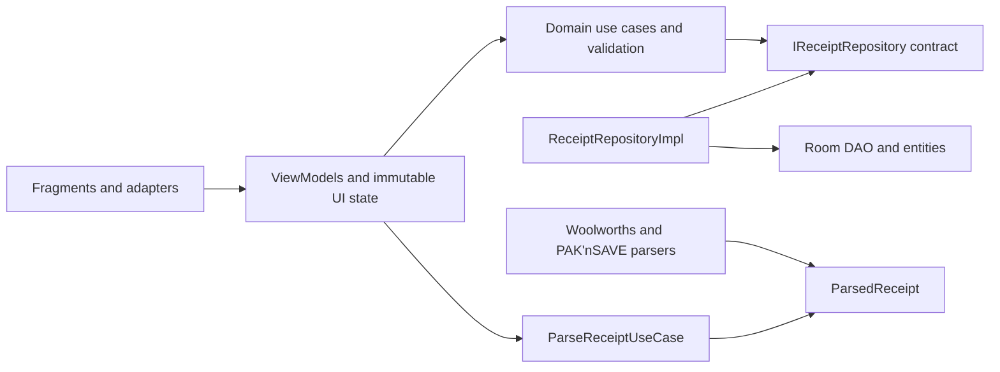
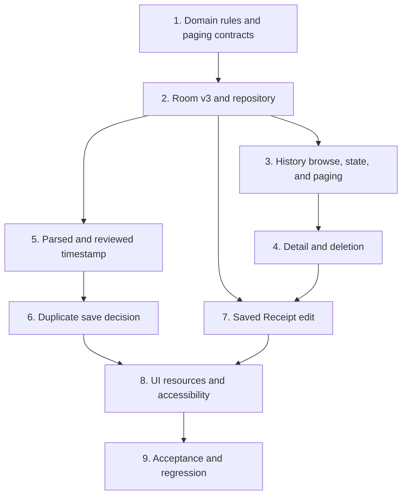

# History Implementation Plan

## 1. Document control

| Field | Value |
| --- | --- |
| Feature ID | `HIS` |
| Feature name | History Completion v1 |
| Document ID | `HIS-IMP-07` |
| Repository source | `07-implementation-plan.md` |
| Version | 0.1 |
| Status | Draft for technical review |
| Date | 2026-08-17 |
| Author | Victor Shih — Systems Analyst |
| Source scope | `HIS-SCP-01`, version 0.8 |
| Source requirements | `HIS-FRS-02`, version 0.9 |
| Source use cases | `HIS-UCS-03`, version 0.8 |
| Source business rules | `HIS-BRS-04`, version 0.7 |
| Source UI specification | `HIS-UIS-05`, version 0.4 |
| Source acceptance tests | `HIS-ATS-06`, version 0.1 |
| Code baseline | `main` at `5fd0fbd` |

### 1.1 Revision history

| Version | Date | Author | Change |
| --- | --- | --- | --- |
| 0.1 | 2026-08-17 | Victor Shih | Initial phased implementation plan based on the approved History analysis and current Java/Room implementation |

## 2. Purpose

This document explains how to implement History Completion v1 without losing
the project's MVVM and Clean Architecture boundaries. It converts the approved
behaviour into small, testable development batches with explicit dependencies,
affected files, test gates, and suggested commit boundaries.

The plan is deliberately written for a junior Android developer:

- each batch has one main learning objective;
- domain and data foundations are completed before dependent UI work;
- every batch must leave the project buildable;
- tests are added with the production behaviour, not postponed until the end;
- proposed new classes exist only when they own a clear responsibility;
- History must not call Scanner Fragment or Scanner ViewModel code.

Class names in this plan are proposed implementation names. They may be changed
during development if the responsibility and requirement traceability remain
the same.

## 3. Current baseline summary

The baseline already has useful MVVM and Clean Architecture foundations:

- `HistoryFragment`, `HistoryViewModel`, Receipt and item adapters;
- `ReceiptDetailFragment` and `ReceiptDetailViewModel`;
- domain repository interfaces and use cases;
- `ReceiptRepositoryImpl`, `ReceiptDao`, Room entities, and database migration
  1 to 2;
- Scanner OCR, Parser, category classification, Review, and initial save;
- an application-level dependency container and ViewModel factory;
- JVM unit tests for parsers, use cases, repositories, and ViewModels.

The baseline does not yet satisfy the approved History v1 behaviour.

| Area | Baseline at `5fd0fbd` | Required target |
| --- | --- | --- |
| History state | Separate `receipts`, `allItems`, `viewMode`, `currentPage`, loading, and error LiveData. | One immutable `HistoryUiState` plus controlled one-time effects. |
| Page sizes | Hard-coded Receipt 10 and Item 25. | Selectable 15, 30, 50; defaults 15 and 30. |
| Page metadata | No count or total-page query; Next has no final-page boundary. | `PageResult` with total records/pages and valid navigation. |
| Mode retention | Switching mode resets a shared page to zero. | Independent current page and page size per mode. |
| Request safety | An older background result can replace a newer selection. | Request generation/token check and last-successful-page recovery. |
| Delete | No confirmation; UI reports success before repository result. | Confirm first, report actual result, no Undo, recover page correctly. |
| Image deletion | Image failure propagates after database deletion. | Database success remains authoritative; image cleanup is best effort. |
| Store matching | Exact case-sensitive Chain/Branch query. | Normalized Chain/Branch identity with empty-Branch equivalence. |
| Receipt ordering | `purchase_date DESC` only. | Full timestamp descending, then stable saved-order FIFO. |
| Timestamp parsing | `ParsedReceipt` has no timestamp; fallback is created after OCR. | Parsed timestamp first; otherwise capture/selection time recorded before OCR. |
| Review timestamp | No date/time controls. | Editable date and `HH:mm:ss` time controls. |
| Branch validation | Scanner code currently requires Branch. | Chain required; Branch optional. |
| Duplicate detection | No contract, use case, or DAO candidate query. | Approved normalized Chain/date-hour/final-total check and Discard/Add decision. |
| Saved Receipt update | No update use case, transaction, ViewModel, Fragment, or navigation. | Atomic same-ID update and unsaved-change flow. |
| UI effects | Toasts and Fragment flags such as `handledSaved`. | Resource-backed Snackbar/navigation effects consumed once. |
| Instrumented tests | Only the example test exists. | Room migration/integration and focused UI tests. |

## 4. Target architecture

### 4.1 Dependency direction



The arrows point toward the dependency being used. Presentation knows domain
contracts, but it must not know `ReceiptDao` or `ReceiptRepositoryImpl`.
Domain classes must not import Android Fragment, ViewModel, Room, or resource
classes.

### 4.2 Proposed responsibility map

| Concern | Proposed owner | Reason |
| --- | --- | --- |
| Page items and metadata | `PageResult<T>` domain model | One return value prevents list/count/page state from becoming separated. |
| Receipt validation | `ReceiptValidator` domain service | Initial save and update apply the same rules without calling Scanner UI code. |
| Store and duplicate normalization | `ReceiptIdentity` domain helper/value policy | One implementation of trim, lowercase, and empty Branch equivalence. |
| Duplicate decision | `CheckDuplicateReceiptUseCase` | Presentation asks one business question; Room details stay hidden. |
| Saved update | `UpdateReceiptUseCase` | Keeps same-ID update validation and repository call outside the Fragment. |
| History state | `HistoryUiState` | One immutable snapshot for selected mode, both paging states, content, and operation status. |
| History transient feedback | `HistoryEffect` wrapped in a consumable event | Snackbar and navigation happen once and are not stored as permanent screen state. |
| Edit state | `ReceiptEditUiState` and `ReceiptEditViewModel` | Saved edit remains independent of Scanner capture/OCR state. |
| Scanner duplicate decision | A pending decision inside `ScannerUiState` plus one-time completion effects | The dialog survives recreation, while save/navigation does not replay. |
| Database identity/order | Room schema version 3 | Explicit normalized Store keys and saved sequence make behaviour deterministic. |

### 4.3 Simplicity rules

- Do not create one class for every requirement or every error message.
- Do not place business validation in a Fragment or adapter.
- Do not make one giant ViewModel serve Scanner, History, Detail, and Edit.
- Reuse `ReceiptValidator`, domain models, repository contracts, formatting
  resources, and the editable-item adapter where they truly share behaviour.
- Keep Scanner Review and saved Receipt Edit as separate presentation flows.
  They may reuse edit components, but History must not depend on
  `ScannerViewModel`.
- Use immutable state replacement rather than mutating several LiveData values
  in an uncertain order.

## 5. Data and contract design

### 5.1 Domain paging result

Introduce a small immutable `PageResult<T>` containing:

- items;
- one-based current page;
- page size;
- total record count;
- total pages, with a minimum value of 1;
- derived `hasPrevious` and `hasNext` values.

The page calculation is:

```text
totalPages = max(1, ceil(totalRecords / pageSize))
offset     = (currentPage - 1) * pageSize
```

The use case validates page size and page number before calling the repository.
The data layer supplies list and count values from one Room transaction so the
returned page is internally consistent.

### 5.2 Room schema version 3

The recommended migration adds explicit persistence needed by approved rules:

| Table | New column | Purpose |
| --- | --- | --- |
| `stores` | `normalized_chain TEXT NOT NULL` | Trimmed/lowercase Chain identity while retaining display `chain_name`. |
| `stores` | `normalized_branch TEXT NOT NULL` | Trimmed/lowercase Branch identity; missing Branch becomes empty string. |
| `receipts` | `saved_sequence INTEGER NOT NULL` | Stable FIFO secondary ordering for equal purchase timestamps. |

The normalized Store columns receive one unique composite index. The old raw
`chain_name`/`branch_name` unique index is replaced.

Migration 2 to 3 must:

1. add and backfill normalized Store columns;
2. map `null`, empty, and whitespace-only Branch to the empty normalized value;
3. remap Receipts that point to Store rows which become duplicates after
   normalization;
4. delete only the now-unreferenced duplicate Store rows;
5. replace the raw Store index with the normalized unique index;
6. add `saved_sequence` and deterministically backfill existing Receipts using
   their legacy insertion/row order as the best available historical order;
7. preserve all Receipt, Item, Discount, category, OCR, and image data;
8. export `app/schemas/.../3.json` and retain it in Git.

New Receipt insertion allocates the next `saved_sequence` inside the same Room
write transaction. Updating an existing Receipt preserves its original
sequence.

### 5.3 Repository contract changes

Replace list-only paging operations with coherent page operations, and add only
the capabilities required by the approved feature:

```text
PageResult<Receipt> getReceiptsPage(pageNumber, pageSize)
PageResult<ReceiptItemSummary> getAllItemsPage(pageNumber, pageSize)
Receipt getReceiptById(receiptId)
List<Receipt> findDuplicateCandidates(normalizedChain, hourStart, hourEnd)
void saveReceipt(receipt)
void updateReceipt(receipt)
void deleteReceipt(receiptId)
```

`CheckDuplicateReceiptUseCase` compares each candidate's calculated final
payable cents. A denormalized total column is not added in v1.

### 5.4 Insert and update transactions

The DAO must stop using Receipt `REPLACE` as a general substitute for update.
Use separate insert and update flows:

- **Insert:** resolve or create normalized Store, allocate saved sequence,
  insert Receipt, Items, and Discounts in one transaction.
- **Update:** load the existing Receipt and old Store, resolve the new normalized
  Store, update the existing Receipt row without changing ID or saved sequence,
  replace the owned Item/Discount graph in one transaction, and delete the old
  Store only if unused.
- **Failure:** Room rolls the complete transaction back.
- **Delete:** delete Receipt-owned database records transactionally, then try to
  remove the private image. Catch/log image cleanup failure without turning the
  successful database deletion into a failure.

## 6. Delivery strategy

The work is divided into nine small batches. A batch is complete only when its
code, focused tests, full JVM regression tests, and Debug build pass. Commit and
push only after that gate.



### 6.1 Batch 1 — Domain rules and paging contracts

**Goal:** Create testable, Android-independent rules before changing Room or UI.

**Primary work:**

- add immutable `PageResult<T>`;
- add `ReceiptIdentity` normalization for Chain and Branch;
- add reusable `ReceiptValidator` covering required Chain, optional Branch,
  item validity, and non-negative totals;
- normalize all new/edited timestamps with `withNano(0)`;
- add `CheckDuplicateReceiptUseCase` contract and `UpdateReceiptUseCase` shell
  against repository abstractions;
- revise `IReceiptRepository` for page, duplicate-candidate, and update
  operations;
- revise existing fake/mock repositories so tests continue to compile.

**Expected files:**

- new domain model/service/use-case files under `domain/`;
- `IReceiptRepository.java`;
- existing paging/save tests and repository fakes.

**Focused tests:**

- page mathematics and invalid boundaries;
- Chain/Branch trim/lower normalization and empty equivalence;
- valid/invalid Receipt and item boundaries;
- negative item and Receipt totals;
- duplicate date/hour boundary and total comparison;
- update preserves the target Receipt ID at the use-case boundary.

**Acceptance coverage started:** `AT-HIS-006`, `AT-HIS-023` through
`AT-HIS-027`, `AT-HIS-039`, `AT-HIS-042` through `AT-HIS-044`.

**Suggested commit:** `feat(domain): add history paging and receipt rules`

### 6.2 Batch 2 — Room v3 and repository integrity

**Goal:** Make paging, ordering, Store identity, duplicate lookup, update, and
delete outcomes reliable before connecting new UI.

**Primary work:**

- update `StoreEntity`, `ReceiptEntity`, `ReceiptDao`, `AppDatabase`,
  `ReceiptRepositoryImpl`, and mappings;
- implement migration 2 to 3 and export schema `3.json`;
- implement transactional list/count page reads;
- order Receipts by purchase timestamp descending and saved sequence ascending;
- give All Items a deterministic parent-Receipt/item order;
- implement normalized Store reuse;
- implement duplicate candidate lookup by normalized Chain and inclusive start /
  exclusive end of purchase hour;
- implement atomic same-ID aggregate update;
- make private-image deletion best effort after database success;
- preserve an existing Store when another Receipt still references it.

**Test infrastructure:**

- add Room testing support to `androidTestImplementation`;
- add a migration test using the committed version 2 schema;
- use an isolated in-memory/on-device test database for DAO transactions.

**Focused tests:**

- migration retains existing data and produces normalized identities;
- migration consolidates case/space/empty-Branch duplicate Stores safely;
- saved sequence is stable and update does not change it;
- Receipt and item counts match page results;
- FIFO ordering remains stable across repeated loads and page boundaries;
- update transaction succeeds completely or rolls back completely;
- shared/unused Store cleanup;
- duplicate candidate hour range;
- image failure does not reverse a database deletion.

**Acceptance coverage completed or enabled:** `AT-HIS-001`, `AT-HIS-004`,
`AT-HIS-016` through `AT-HIS-019`, `AT-HIS-025`, `AT-HIS-029` through
`AT-HIS-031`, `AT-HIS-042` through `AT-HIS-044`, `AT-HIS-048`,
`AT-HIS-049`.

**Suggested commit:** `feat(data): add history paging and receipt update storage`

### 6.3 Batch 3 — History browse, unified state, and paging UI

**Goal:** Complete browsing and paging with one predictable MVVM state.

**Primary work:**

- add immutable `HistoryUiState` with a small per-mode paging state;
- replace split History LiveData with one state LiveData;
- retain Receipt and All Items page/page-size values independently;
- implement Loading, Content, Empty, initial Error, Refreshing, and page-change
  presentation;
- use a monotonically increasing request ID/token so obsolete results are
  ignored;
- retain the last successful page during refresh/page requests;
- restore it after page failure;
- fall back to the final valid page after Refresh reduces total pages;
- prevent duplicate initial loads caused by Fragment setup and tab callbacks;
- add page-size Dropdown values 15/30/50 and direct-page Dropdown;
- bind Previous/Next boundaries and `Page 1 of 1` Empty behaviour;
- retain current Receipt timestamp and All Items date display formats.

**Expected presentation files:**

- new `HistoryUiState.java` and `HistoryEffect.java`;
- `HistoryViewModel.java`, `HistoryFragment.java`;
- `fragment_history.xml`, Receipt/item adapters and row layouts;
- `strings.xml` for all introduced text.

**Focused tests:**

- every state transition using a controlled executor;
- independent mode state and all page sizes;
- direct page, Previous, Next, and zero-record rules;
- stale-result completion order;
- initial failure/Retry, Refresh success/failure, page failure, and invalid-page
  fallback;
- Fragment renders one state without triggering an extra request.

**Acceptance coverage:** `AT-HIS-001` through `AT-HIS-013`.

**Suggested commit:** `feat(history): complete browse state and paging`

### 6.4 Batch 4 — Receipt Detail and safe deletion

**Goal:** Complete the Detail entry point and truthful delete workflow.

**Primary work:**

- introduce one immutable Receipt Detail screen state rather than separate
  loading/data/error values;
- show inline loading/error and Retry where applicable;
- add the Edit toolbar action and pass only the stable Receipt ID;
- make the Receipt card Delete target at least 48 dp and prevent card navigation
  when Delete is selected;
- show confirmation before invoking `DeleteReceiptUseCase`;
- disable repeated confirmation while deletion is active;
- show success or failure Snackbar only after the actual result;
- do not provide Undo;
- reload the current page, move to the previous valid page when required, or
  display Empty `Page 1 of 1`.

**Focused tests:**

- correct ID opens Detail;
- Cancel confirmation performs no repository call;
- confirmed delete passes the exact ID;
- database success/image failure still reports success;
- database failure reports failure and retains truthful content;
- deleting the only later-page row moves to the previous page;
- no Undo action appears.

**Acceptance coverage:** `AT-HIS-014` through `AT-HIS-021`.

**Suggested commit:** `feat(history): complete receipt detail and deletion`

### 6.5 Batch 5 — Parsed and reviewed purchase timestamp

**Goal:** Establish one authoritative timestamp before duplicate detection is
added.

**Primary work:**

- add nullable purchase timestamp to `ParsedReceipt`;
- extend Woolworths and PAK'nSAVE Parsers with chain-specific date/time patterns
  backed by real anonymized fixtures;
- inject `java.time.Clock` into the Scanner flow;
- record fallback `LocalDateTime.now(clock)` synchronously when image capture or
  gallery selection is accepted, before OCR work starts;
- prefer a valid parsed timestamp and otherwise retain the recorded fallback;
- normalize the selected timestamp to second precision;
- add purchase date, TimePicker hour/minute, and seconds 00–59 controls to
  Scanner Receipt Review;
- preserve seconds when only hour/minute changes;
- remove `Unknown Branch` fallback and treat blank Branch as valid empty data;
- ensure edited date/time values live in `ScannerUiState`, not only in Views.

**Focused tests:**

- each supported Parser timestamp format and invalid/missing timestamp;
- parsed timestamp wins over fallback;
- fallback equals controlled capture/selection time, not OCR completion time;
- fractional seconds become zero;
- Review date/time editing and seconds boundaries;
- blank Branch saves without a Branch-required error.

**Acceptance coverage:** `AT-HIS-023`, `AT-HIS-036` through `AT-HIS-038`.

**Suggested commit:** `feat(scanner): add receipt timestamp review`

### 6.6 Batch 6 — Duplicate Receipt decision

**Goal:** Prevent accidental duplicate insertion while keeping the user's final
choice explicit.

**Primary work:**

- validate and calculate the final draft before duplicate lookup;
- call `CheckDuplicateReceiptUseCase` only for initial insert;
- save unique Receipts normally without a dialog;
- represent a matching pending decision in `ScannerUiState` so it survives view
  recreation;
- display exactly:
  - title `Possible duplicate receipt`;
  - message `Add anyway?`;
  - actions `Discard` and `Add`;
- make Discard close the dialog, insert nothing, delete nothing, and retain the
  current Review draft;
- make Add perform exactly one insertion;
- disable repeated save/Add input while checking or saving;
- replace `handledSaved` and repeated-message comparisons with explicit
  consumable effects for Snackbar/navigation.

**Focused tests:**

- unique insert once with no prompt;
- exact dialog content and zero pre-decision insertion;
- Discard retains Review and database count;
- Add inserts once even across observer reattachment;
- branch difference does not affect duplicate matching;
- date/hour/total/Chain boundaries;
- failed insertion retains draft and emits one failure effect.

**Acceptance coverage:** `AT-HIS-039` through `AT-HIS-046` where duplicate and
lifecycle behaviour apply.

**Suggested commit:** `feat(scanner): add duplicate receipt confirmation`

### 6.7 Batch 7 — Edit a saved Receipt

**Goal:** Add a separate History edit flow that reuses domain rules without
coupling History to Scanner capture logic.

**Primary work:**

- add `ReceiptEditFragment`, `ReceiptEditViewModel`, `ReceiptEditUiState`, and
  `fragment_receipt_edit.xml`;
- add Detail-to-Edit navigation with a required Receipt ID argument;
- load the complete Receipt aggregate through `GetReceiptByIdUseCase`;
- reuse/rename the editable item adapter as a presentation component shared by
  Review and Edit, without sharing Scanner ViewModel state;
- allow Chain, optional Branch, purchase date, item name, quantity, unit, unit
  price, category, add item, and remove item;
- keep saved time-of-day unchanged when History Edit changes purchase date;
- keep raw OCR, image, printed total, and Item Discounts read-only;
- do not invoke OCR, chain detection, or a Parser;
- preserve Discounts on retained items, remove them with removed items, and
  start new items with no Discounts;
- recalculate totals and show the greater-than-one-cent printed-total warning;
- apply shared validation and atomic `UpdateReceiptUseCase`;
- track the original immutable aggregate for dirty-state comparison;
- implement Cancel, Back without changes, Keep Editing, and `Don't Save`;
- return to Detail and reload the same Receipt ID after successful update.

**Focused tests:**

- complete initial field mapping;
- every editable field and validation boundary;
- date-only edit preserves hour/minute/second;
- item/Discount retention and removal;
- total recalculation and printed-total warning threshold;
- same-ID update and unchanged Receipt count;
- transactional rollback and draft retention after failure;
- old/new/shared/unused Store outcomes;
- all Cancel and Back branches;
- no self-duplicate prompt on update.

**Acceptance coverage:** `AT-HIS-022` through `AT-HIS-035`.

**Suggested commit:** `feat(history): add saved receipt editing`

### 6.8 Batch 8 — Resource, accessibility, and UI polish

**Goal:** Make the completed behaviour consistent, accessible, and safe on the
supported device range.

**Primary work:**

- move every new History/Detail/Edit/Review user-facing string to
  `strings.xml`, including plurals and error messages;
- replace Toast outcomes with Material Snackbar where specified;
- keep inline initial Error and field-level validation;
- associate validation text with fields and focus the first invalid field;
- add content descriptions for icon-only actions;
- ensure all action targets are at least 48 dp;
- verify small-phone portrait layouts do not clip bottom actions;
- verify blank Branch binds an empty value without `Unknown Branch`;
- verify Receipt/Detail timestamp `yyyy-MM-dd HH:mm`, Review time `HH:mm:ss`,
  and All Items date `yyyy-MM-dd`;
- remove obsolete Fragment flags, hard-coded text, and unused state observers.

**Focused checks:** Android lint, API 26 emulator, current-target emulator,
screen-reader traversal review, rotation/recreation, and small-screen layout.

**Acceptance coverage:** `AT-HIS-045` through `AT-HIS-047`, plus UI portions of
all earlier scenarios.

**Suggested commit:** `chore(ui): finish history resources and accessibility`

### 6.9 Batch 9 — Full acceptance and regression

**Goal:** Prove the complete feature meets documents 01 through 06 and did not
break Scanner, OCR, Parser, category, or existing data.

**Primary work:**

- run all JVM and connected Android tests;
- execute the manual end-to-end journey in acceptance document section 6;
- execute the offline flow;
- verify migration from version 2 using a database containing real-shaped test
  data;
- record Pass/Fail/Blocked and evidence for `AT-HIS-001` through
  `AT-HIS-050`;
- update requirement/test traceability only if implementation names changed;
- update README and architecture/system documents to match implemented code;
- do not silently relax a requirement to make a failing test pass.

**Suggested commit:** `test(history): complete acceptance and regression coverage`

## 7. Planned file impact

### 7.1 Existing files expected to change

| Layer | Files / areas | Main change |
| --- | --- | --- |
| Domain | `IReceiptRepository`, current paging/save/delete use cases, `ParsedReceipt` | Page contract, validation, duplicate/update operations, timestamp output. |
| Data | `AppDatabase`, `ReceiptDao`, `ReceiptRepositoryImpl`, `StoreEntity`, `ReceiptEntity`, Parsers | Migration, normalized identity, stable order, count/page queries, update, duplicate candidates, parsed time. |
| DI | `AppContainer`, `ViewModelFactory` | Construct new use cases/ViewModels and inject `Clock`/executor dependencies. |
| Presentation | History, Detail, Review Fragments/ViewModels/adapters | Unified state, effects, controls, dialogs, and navigation. |
| Resources | History/Detail/Review layouts, row layouts, navigation graph, strings | Approved UI controls, Edit screen route, resources, accessibility. |
| Tests | Existing fake repositories and unit tests | Compile against new contracts and retain regression coverage. |

### 7.2 New files likely required

The exact package names may be adjusted, but each proposed file has one clear
reason to exist.

| Proposed file | Responsibility |
| --- | --- |
| `domain/model/PageResult.java` | Immutable page content and metadata. |
| `domain/logic/ReceiptIdentity.java` | Store and duplicate normalization rules. |
| `domain/logic/ReceiptValidator.java` | Shared initial-save/update validation. |
| `domain/usecase/CheckDuplicateReceiptUseCase.java` | Duplicate business decision before insert. |
| `domain/usecase/UpdateReceiptUseCase.java` | Atomic same-ID update boundary. |
| `presentation/viewmodel/HistoryUiState.java` | Complete History screen snapshot. |
| `presentation/viewmodel/HistoryEffect.java` | One-time History feedback/navigation value. |
| `presentation/viewmodel/ReceiptDetailUiState.java` | Complete Detail screen snapshot. |
| `presentation/viewmodel/ReceiptEditUiState.java` | Saved-edit draft, validation, operation state, and dirty state. |
| `presentation/viewmodel/ReceiptEditViewModel.java` | Saved Receipt edit coordination. |
| `presentation/view/ReceiptEditFragment.java` | Saved Receipt edit rendering and input forwarding. |
| `res/layout/fragment_receipt_edit.xml` | Saved Receipt edit UI. |
| Room integration and migration test files | Schema, transaction, order, and compatibility proof. |

A generic event wrapper may be introduced once under presentation if both
History and Scanner need it. Do not create separate nearly identical wrappers
for each screen.

## 8. Test commands and batch gate

The following PowerShell commands are the standard local verification sequence.
`clean` is not required for every change; use it for migration/resource issues
or a final clean verification.

```powershell
# Fast JVM tests after each focused change
.\gradlew.bat testDebugUnitTest

# Build the installable Debug APK
.\gradlew.bat assembleDebug

# Room migration, DAO, and UI instrumented tests with an emulator running
.\gradlew.bat connectedDebugAndroidTest

# Resource, accessibility, and static Android checks
.\gradlew.bat lintDebug

# Final clean gate before the feature PR is accepted
.\gradlew.bat clean testDebugUnitTest assembleDebug connectedDebugAndroidTest lintDebug
```

Each batch must satisfy:

1. focused new tests pass;
2. all existing JVM tests pass;
3. `assembleDebug` succeeds;
4. relevant connected tests pass when the batch changes Room or UI;
5. no unexpected schema file is deleted or ignored;
6. `git diff` contains only the intended batch;
7. manual smoke test passes for the changed user path;
8. commit message and PR notes identify the acceptance scenarios covered.

## 9. Requirement-to-batch traceability

| Requirement group | Primary batch | Final verification |
| --- | --- | --- |
| `FR-HIS-BRW-*` | Batch 2 and Batch 3 | `AT-HIS-001`, `003`, `004`, `008`, `010`, `011`, `014`, `036`–`038` |
| `FR-HIS-PAG-*` | Batch 1 through Batch 3 | `AT-HIS-001` through `008`, `013`, `020` |
| `FR-HIS-STA-*` | Batch 3 | `AT-HIS-001`, `002`, `008` through `013` |
| `FR-HIS-DEL-*` | Batch 2 and Batch 4 | `AT-HIS-015` through `021` |
| `FR-HIS-EDT-*` | Batch 1, Batch 2, and Batch 7 | `AT-HIS-022` through `035` |
| `FR-HIS-DUP-*` | Batch 1, Batch 2, and Batch 6 | `AT-HIS-039` through `043` |
| `FR-HIS-TIM-*` | Batch 5 | `AT-HIS-036` through `038` |
| `FR-HIS-STR-*` | Batch 1 and Batch 2 | `AT-HIS-030`, `043`, `044` |
| `NFR-HIS-ARC-*` | Every batch | `AT-HIS-050` |
| `NFR-HIS-DAT-*` | Batch 1, Batch 2, and Batch 9 | `AT-HIS-026`, `027`, `048`, `049` |
| Other `NFR-HIS-*` | Batch 8 and Batch 9 | `AT-HIS-045` through `050` |

## 10. Main risks and controls

| Risk | Consequence | Control |
| --- | --- | --- |
| Incorrect Room migration | Existing user data is lost or database open fails. | Commit schemas, test 2-to-3 migration with populated data, never use destructive fallback. |
| Normalization creates Store collisions | Migration violates the new unique index. | Remap Receipt foreign keys to one canonical Store before deleting duplicates and creating the index. |
| List and count disagree | Invalid page UI or missing/duplicated records. | Read list and count in one Room transaction and return one `PageResult`. |
| Unstable equal-time order | Records move between pages. | Persist `saved_sequence`; use it as ascending secondary order. |
| Receipt `REPLACE` changes identity/children | Accidental delete/reinsert or sequence change. | Separate insert from transactional same-ID update. |
| Derived total differs in SQL and Java | Duplicate detection is incorrect. | Query hour candidates, calculate final total with the existing domain model in cents. |
| OCR finishes after another selection | Wrong image/timestamp becomes current draft. | Request token and capture timestamp per scan request; ignore obsolete completion. |
| Rotation repeats save/dialog/navigation | Duplicate insert or repeated message. | Persistent pending decision in state plus consumable completion effects. |
| Edit partially writes aggregate | Store/Receipt/Items become inconsistent. | One Room update transaction and rollback integration test. |
| Image deletion throws after DB success | UI incorrectly reports failed deletion although data is gone. | Catch/log cleanup error after committed database transaction. |
| UI and domain validation diverge | A path saves data another path rejects. | One reusable domain validator; UI only presents its result. |
| Refactor is too large to diagnose | Junior developer cannot locate regression. | Keep nine buildable batches and one intentional commit per completed batch. |

## 11. Definition of done

History Completion v1 is implemented only when:

- all nine batches pass their gates;
- the database migrates from version 2 without destructive fallback;
- schema version 3 is committed;
- History uses one immutable state and retains independent mode paging;
- save/update/delete operations are truthful and transactional where required;
- Scanner uses parsed timestamp or capture/selection fallback correctly;
- the duplicate dialog exactly displays `Possible duplicate receipt`,
  `Add anyway?`, `Discard`, and `Add`;
- Discard inserts nothing and retains Review; Add inserts exactly once;
- saved Receipt Edit updates the same ID and never runs OCR/Parser;
- every `AT-HIS-001` through `AT-HIS-050` has recorded evidence;
- all 94 Must requirements remain covered by the acceptance matrix;
- README and system documentation describe the implemented, not planned,
  architecture.

## 12. Technical review checklist

No new business decision is required before Batch 1. Before implementation,
the developer should confirm only technical feasibility:

- Room version 2 schema JSON exists and is valid input for migration testing;
- the proposed version 3 normalized Store columns do not conflict with another
  pending database branch;
- representative Woolworths and PAK'nSAVE date/time formats are available as
  anonymized parser fixtures;
- API 26 supports every selected date/time UI component;
- the planned branch starts from the documented baseline or an explicitly
  reviewed newer main commit.

If one of these checks fails, revise this implementation plan. Do not change an
approved business rule without first revising documents 01 through 06.

## 13. Approval

| Role | Name | Decision | Date | Notes |
| --- | --- | --- | --- | --- |
| Systems Analyst | Victor Shih | Pending | — | — |
| Developer | — | Pending technical review | — | — |
| Tester | — | Pending test-plan review | — | — |
