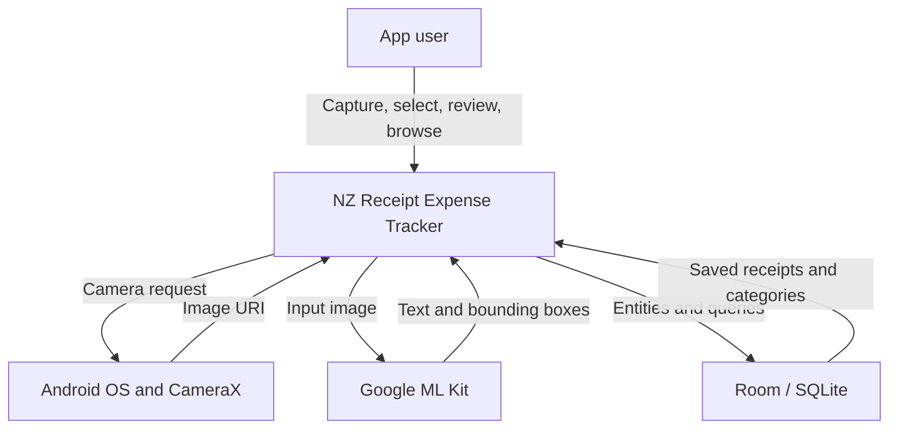

# 01 — System Context and Scope

## 1. Purpose

The NZ Receipt Expense Tracker helps a person convert supermarket receipt images
into structured, locally stored expense records. OCR and receipt parsers are not
assumed to be perfectly accurate, so the system places a human review step before
persistence.

## 2. Problem statement

Paper receipts are difficult to search, aggregate, and reuse for expense
analysis. Manual entry is slow, while raw OCR output loses receipt structure and
can separate an item name from its price. Supermarket formats also differ.

The system must therefore:

- acquire a receipt image;
- preserve enough image layout to reconstruct receipt rows;
- interpret supported supermarket formats;
- classify items consistently;
- expose uncertainty to the user;
- save only user-confirmed information;
- retain source evidence for troubleshooting and future reprocessing.

## 3. Product objectives

| ID | Objective | Current evidence |
| --- | --- | --- |
| OBJ-01 | Reduce manual entry for supported NZ receipts | OCR, parsers, category rules |
| OBJ-02 | Prevent silent storage of incorrect OCR data | Mandatory review-before-save flow |
| OBJ-03 | Preserve auditable source information | Private image URI, raw OCR, printed total |
| OBJ-04 | Keep core rules testable and maintainable | Domain contracts, use cases, 31 JVM tests |
| OBJ-05 | Provide a foundation for expense analysis | Structured Room data and analytics use case |
| OBJ-06 | Support developer learning | Explicit Java MVVM/Clean Architecture boundaries |

Proposed future success measures should include parser item precision by chain,
printed-total match rate, average correction count per receipt, crash-free scan
rate, and time from image selection to review. These metrics are not currently
collected.

## 4. Stakeholders and actors

| Stakeholder / actor | Interest or responsibility |
| --- | --- |
| App user | Capture, correct, store, browse, and delete personal receipt records |
| Product owner | Define supported chains, required data, and acceptable accuracy |
| Systems analyst | Control scope, requirements, rules, traceability, and acceptance |
| Android developer | Implement maintainable behaviour within architecture boundaries |
| Tester | Verify happy paths, exceptions, regression fixtures, and migrations |
| Android OS | Supplies permissions, camera lifecycle, content URIs, and app storage |
| Google ML Kit | Supplies Latin text recognition results and bounding boxes |
| Room / SQLite | Persists relational data and enforces schema constraints |

The only human actor in the current app is the app user. Developer and tester are
stakeholders, not runtime actors.

## 5. System context

There is no application backend, account system, OpenAI API integration, or
cross-device synchronisation in the current boundary.

## 6. In scope — current release

- Android phone or emulator operation on API 26 or later.
- Camera, gallery, and bundled Woolworths sample input.
- Google ML Kit Latin OCR.
- Spatial reconstruction of OCR lines.
- Chain selection or auto-detection for Woolworths, Countdown, and PAK'nSAVE.
- Woolworths/Countdown and PAK'nSAVE rule-based parsing.
- Printed-total recognition where the receipt format is supported.
- Bundled two-level category rules and longest-keyword classification.
- Review and editing of store and item data before save.
- Local private image storage and Room database persistence.
- Receipt/item history, receipt detail, pagination, refresh, and deletion.
- Domain-level category-spending calculation.
- Local JVM unit tests.

## 7. Partial or planned scope

| Capability | Classification | Boundary statement |
| --- | --- | --- |
| Analytics UI | Partial | Domain calculation exists; no ViewModel or visible UI |
| Receipt date recognition | Planned | Current date defaults to processing time |
| New World parser | Planned | No registered implementation |
| Four Square parser | Planned | No registered implementation |
| Parser warnings/confidence | Planned | Current outcome is success or error plus manual review |
| Export/backup | Planned | No user-facing export contract |
| Cloud sync | Planned | `isSynced` is only a stored flag |
| CI and instrumentation tests | Planned | No GitHub Actions or device suite |

## 8. Out of scope for the current baseline

- Financial, tax, accounting, or budgeting advice.
- Payment processing or bank integration.
- User accounts, authentication, or multi-user access control.
- Server-side storage or web administration.
- Guaranteed recognition of every receipt layout.
- Automatic saving without user review.
- iOS, web, or desktop clients.
- Real-time supermarket catalogue or price comparison.

## 9. Operating constraints

| ID | Constraint |
| --- | --- |
| CON-01 | Android minimum SDK is 26; target SDK is 36 |
| CON-02 | Production code is Java with Java 11 source compatibility |
| CON-03 | The app remains one Gradle module while scope is small |
| CON-04 | OCR depends on Google ML Kit text recognition availability |
| CON-05 | Receipt parsing is deterministic and chain-specific |
| CON-06 | Images and database records are local to the Android installation |
| CON-07 | Money is stored as integer cents; quantity may be decimal |
| CON-08 | Database changes require a version increment and explicit migration |
| CON-09 | No GitHub Actions gate currently protects `main` |

## 10. Assumptions and dependencies

| ID | Assumption / dependency | Impact if false |
| --- | --- | --- |
| ASM-01 | The selected image URI remains readable long enough to copy | Image preparation fails |
| ASM-02 | Receipt text primarily uses Latin characters | OCR quality may degrade |
| ASM-03 | Supported receipts contain enough row/price structure | Parser may return no items |
| ASM-04 | Store branding text exists for auto-detection | User must select a chain |
| ASM-05 | The user can correct OCR mistakes | Saved data may remain inaccurate |
| ASM-06 | Bundled category TSV is valid and tab-separated | Initialisation may skip malformed rows |
| ASM-07 | One chain/branch pair represents one reusable Store | Store uniqueness rule may be inadequate |
| ASM-08 | Android private files persist while the app data exists | Image evidence can be retained |

## 11. Glossary

| Term | Meaning in this system |
| --- | --- |
| OCR | Optical character recognition of receipt text |
| OCR fragment | Recognised text plus its bounding rectangle |
| Parsed receipt | Parser output containing items and optional printed total |
| Draft | In-memory receipt awaiting user confirmation |
| Printed total | Total amount recognised from the receipt text |
| Calculated total | Sum derived from structured item values and discounts |
| Chain | Supermarket brand, such as Woolworths or PAK'nSAVE |
| Branch | Physical store location name |
| Category rule | Keyword mapped to a child category |
| Repository | Boundary used by domain logic to access persistent data |
| Use case | One application-level user or business action |
| Room schema | Versioned JSON and SQLite structure managed by Room |

## 12. Open analysis questions

- What parser accuracy is acceptable before adding a new supermarket chain?
- Should purchase date and time be mandatory before save?
- Should a total mismatch block save or remain a warning?
- Should category rules be editable by users?
- What export format is required: CSV, JSON, PDF, or accounting integration?
- What retention and backup policy should apply to receipt images and raw OCR?
- Should receipt/store equality be case-insensitive and whitespace-normalised?
- What analytics outcomes are valuable enough to define before building the UI?
