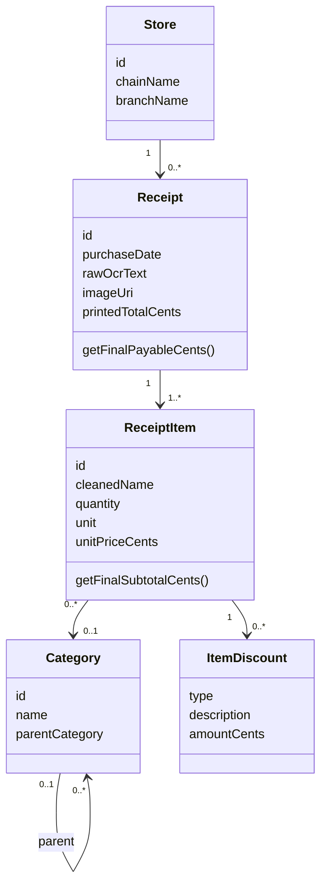
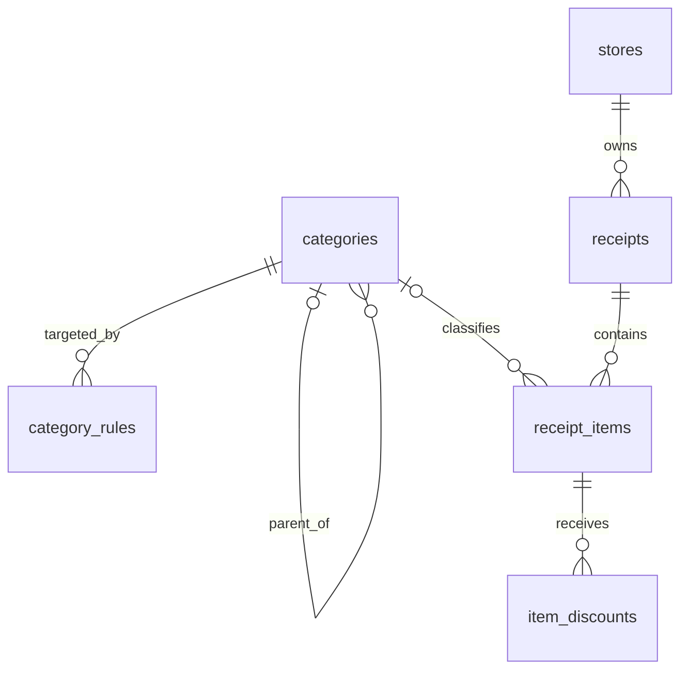

# 04 — Business Rules and Data Dictionary

## 1. Business rules

### Receipt and workflow rules

| ID | Rule | Current enforcement |
| --- | --- | --- |
| BR-RCT-01 | A persistent receipt must belong to one Store | Room non-null FK |
| BR-RCT-02 | A receipt may be saved only after review | Scanner state/workflow |
| BR-RCT-03 | A saved receipt must contain at least one valid item | ViewModel/review validation |
| BR-RCT-04 | Chain and branch must be non-blank at save time | `createEditedReceipt` |
| BR-RCT-05 | Missing branch during initial parse becomes `Unknown Branch` | `ParseReceiptUseCase` |
| BR-RCT-06 | Purchase date currently equals processing time unless supplied | Parse use case |
| BR-RCT-07 | Raw OCR and private image URI are retained with a saved receipt | Domain and Room v2 |
| BR-RCT-08 | A failed or cancelled unsaved draft must not retain its private image | Scanner ViewModel |

### Parser and category rules

| ID | Rule | Current enforcement |
| --- | --- | --- |
| BR-PRS-01 | Countdown is treated as Woolworths for detection and parser selection | `ParserProvider` |
| BR-PRS-02 | PAK'nSAVE matching ignores apostrophes and ordinary spaces | `ParserProvider` |
| BR-PRS-03 | Unsupported chains have no fallback parser | Null parser → error |
| BR-PRS-04 | A parse with zero recognised items is invalid | Parse use case |
| BR-CAT-01 | Category hierarchy is limited to parent and child levels in current UI | Model/initializer |
| BR-CAT-02 | Category matching is case-insensitive | Classifier normalisation |
| BR-CAT-03 | Common quantities/units and `^`, `*`, `#` are removed before matching | Classifier cleaning |
| BR-CAT-04 | Only whole normalised keywords match | Space-delimited contains check |
| BR-CAT-05 | The longest matching keyword wins | Classifier selection |
| BR-CAT-06 | User review overrides automatic category assignment | Review selection |

### Financial rules

| ID | Rule | Current enforcement |
| --- | --- | --- |
| BR-TOTAL-01 | Currency amounts are represented as integer cents | Domain and Room fields |
| BR-TOTAL-02 | Original item subtotal is `round(quantity × unitPriceCents)` | `ReceiptItem` |
| BR-TOTAL-03 | Item discount amounts are stored as positive cents | `ItemDiscount` contract |
| BR-TOTAL-04 | Final item subtotal is original subtotal minus all item discounts | `ReceiptItem` |
| BR-TOTAL-05 | Receipt original total is the sum of original item subtotals | `Receipt` |
| BR-TOTAL-06 | Final payable is item final subtotals minus receipt-level discount | `Receipt` |
| BR-TOTAL-07 | Review warns when printed and calculated totals differ by more than one cent | Review fragment |
| BR-TOTAL-08 | A total mismatch is advisory and does not block save | Current review policy |

### Persistence rules

| ID | Rule | Current enforcement |
| --- | --- | --- |
| BR-DAT-01 | Store chain/branch combination is unique | Unique Room index |
| BR-DAT-02 | Saving reuses a Store with matching chain and branch | DAO transaction |
| BR-DAT-03 | Deleting a Store cascades to its receipts | Room FK |
| BR-DAT-04 | Deleting a Receipt cascades to items and their discounts | Room FKs |
| BR-DAT-05 | Deleting a Category sets item category to null | Room FK `SET NULL` |
| BR-DAT-06 | Deleting a Category cascades to child categories and rules | Room FKs |
| BR-DAT-07 | An unused Store is deleted after receipt deletion | DAO transaction |

## 2. Calculation definitions

For item `i`:

```text
originalSubtotalCents(i) = round(quantity(i) × unitPriceCents(i))
itemDiscountCents(i)     = sum(discount.amountCents)
finalSubtotalCents(i)    = originalSubtotalCents(i) - itemDiscountCents(i)
```

For receipt `r`:

```text
originalTotalCents(r) = sum(originalSubtotalCents(item))
finalPayableCents(r)  = sum(finalSubtotalCents(item)) - totalDiscountCents(r)
```

Open rule question: the model does not currently prevent a discount from making
an item or receipt total negative. A future validation rule should define whether
negative totals are invalid, clamped, or explicitly supported.

## 3. Domain information model



## 4. Physical data model



## 5. Table dictionary

### `categories`

| Column | Type | Null | Meaning |
| --- | --- | --- | --- |
| `id` | TEXT PK | No | UUID category identifier |
| `name` | TEXT | Yes | Display/category name |
| `parent_id` | TEXT FK | Yes | Parent category; null identifies a root category |

`parent_id` references `categories.id`, cascades on delete, and is indexed.

### `category_rules`

| Column | Type | Null | Meaning |
| --- | --- | --- | --- |
| `id` | INTEGER PK | No | Auto-generated rule row ID |
| `keyword` | TEXT | No | Normalised unique matching keyword |
| `category_id` | TEXT FK | No | Child category assigned by the rule |

`keyword` is unique. Category deletion cascades to its rules.

### `stores`

| Column | Type | Null | Meaning |
| --- | --- | --- | --- |
| `id` | TEXT PK | No | UUID store identifier |
| `chain_name` | TEXT | Yes | Supermarket chain |
| `branch_name` | TEXT | Yes | Store location/branch |

The `(chain_name, branch_name)` combination has a unique index. Domain save
validation requires non-blank values even though the physical columns are
nullable for migration compatibility.

### `receipts`

| Column | Type | Null | Meaning |
| --- | --- | --- | --- |
| `id` | TEXT PK | No | UUID receipt identifier |
| `store_id` | TEXT FK | No | Owning Store |
| `purchase_date` | TEXT | Yes | `LocalDateTime` converted to storage text |
| `total_discount_cents` | INTEGER | No | Receipt-level discount |
| `is_synced` | INTEGER | No | Reserved local synchronisation flag |
| `raw_ocr_text` | TEXT | Yes | Reconstructed OCR input used for parsing |
| `image_uri` | TEXT | Yes | URI of app-private source image |
| `printed_total_cents` | INTEGER | Yes | Recognised printed total, if available |

Store deletion cascades to receipts. `store_id` is indexed.

### `receipt_items`

| Column | Type | Null | Meaning |
| --- | --- | --- | --- |
| `id` | TEXT PK | No | UUID item identifier |
| `receipt_id` | TEXT FK | No | Owning Receipt |
| `raw_name` | TEXT | Yes | Parser/OCR source text for the item |
| `cleaned_name` | TEXT | Yes | User-facing normalised item name |
| `quantity` | REAL | No | Count or weight quantity |
| `unit` | TEXT | Yes | `ea`, `KG`, `g`, or parser-derived unit |
| `unit_price_cents` | INTEGER | No | Price per stored quantity unit |
| `category_id` | TEXT FK | Yes | Assigned child category |
| `special_mk` | INTEGER | No | Boolean special-item marker |

Receipt deletion cascades to items. Category deletion sets `category_id` to
null. Both foreign keys are indexed.

### `item_discounts`

| Column | Type | Null | Meaning |
| --- | --- | --- | --- |
| `id` | INTEGER PK | No | Auto-generated discount row ID |
| `receipt_item_id` | TEXT FK | No | Owning item |
| `type` | TEXT | Yes | Discount enum value |
| `description` | TEXT | Yes | Source/description text |
| `amount_cents` | INTEGER | No | Positive discount amount |

Item deletion cascades to discounts. `receipt_item_id` is indexed.

## 6. Data lifecycle

| Stage | Data state | Retention |
| --- | --- | --- |
| Camera capture | Temporary external-cache JPEG | Until copied or cache cleanup |
| Gallery selection | External content URI | Read long enough to copy |
| Prepared input | App-private JPEG | Draft lifetime or saved receipt lifetime |
| OCR/parse | In-memory text and domain draft | Until state reset; raw OCR copied into saved receipt |
| Saved receipt | Room rows plus private image | Until user deletion/app data removal |
| Cancel/failure | No Room row | Private draft image deleted |
| Receipt deletion | Receipt aggregate removed | Image and unused Store also removed |

## 7. Schema evolution

The current schema is version 2. `MIGRATION_1_2`:

- adds `raw_ocr_text`, `image_uri`, and `printed_total_cents`;
- creates category foreign-key indexes;
- rewrites duplicate receipt Store references to one canonical Store;
- deletes unused duplicate Stores;
- creates the unique chain/branch index.

The exported `2.json` is a design and verification artefact, not user data. It
must remain version-controlled.
