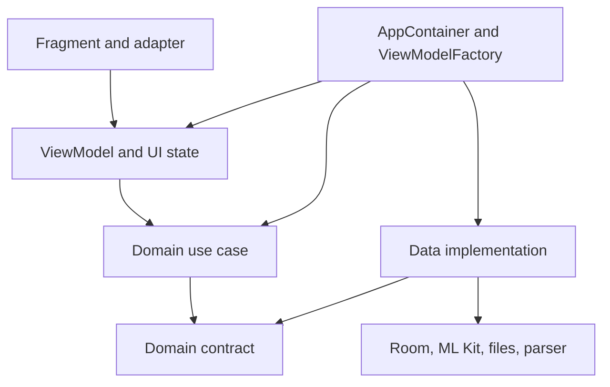
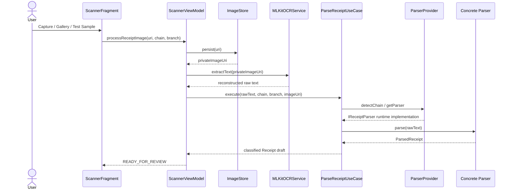
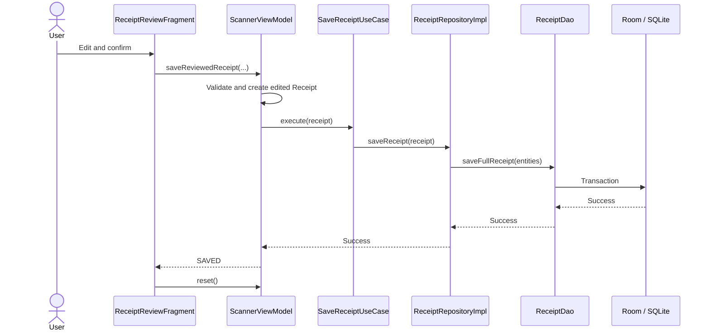
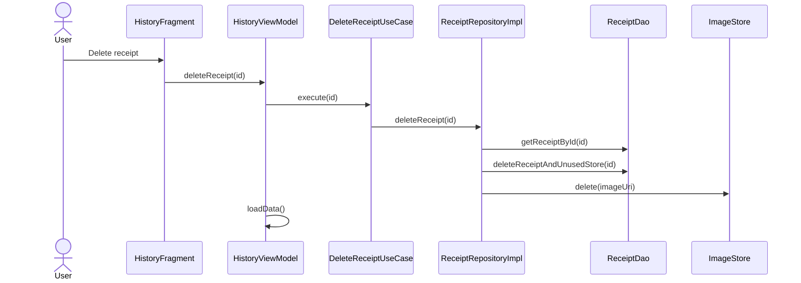

# 05 — Architecture and Interfaces

## 1. Architecture style

The application combines MVVM in the presentation layer with Clean Architecture
dependency direction across one Android module. Package separation is currently
more valuable than multi-module build complexity.

The domain layer has no dependency on Android or data implementations. Runtime
composition is performed at the edge of the app.

## 2. Runtime containers and lifecycle

| Component | Lifetime | Responsibility |
| --- | --- | --- |
| `NzReceiptApplication` | App process | Own one `AppContainer` |
| `AppContainer` | App process | Create database, services, repositories, use cases, executor |
| `MainActivity` | Activity | Host NavHost and bottom navigation |
| `ViewModelFactory` | Construction helper | Supply ViewModels with container dependencies |
| `ScannerViewModel` | Activity-scoped | Share draft between Scanner and Review |
| History/Detail ViewModels | Fragment-scoped | Own one screen's loading and data state |
| Fragment View Binding | Fragment view lifecycle | Access inflated XML views; cleared in `onDestroyView` |

Scanner and Review intentionally request `ScannerViewModel` from
`requireActivity()`. This shares the draft without serialising it into navigation
arguments. Other screens use fragment-scoped ViewModels.

## 3. Receipt-processing sequence

`OcrTextLayoutBuilder` runs inside `MLKitOCRService` before the raw text reaches
the use case. Category initialisation and classification run inside
`ParseReceiptUseCase` after format parsing.

## 4. Review-and-save sequence

## 5. Delete sequence

## 6. Domain interfaces

| Interface | Consumer | Current implementation | Purpose |
| --- | --- | --- | --- |
| `IOCRService` | `ScannerViewModel` | `MLKitOCRService` | Asynchronous image-to-text boundary |
| `IReceiptImageStore` | ViewModel/repository | `LocalReceiptImageStore` | Persist/delete private receipt images |
| `IParserFactory` | `ParseReceiptUseCase` | `ParserProvider` | Detect chain and supply parser |
| `IReceiptParser` | `ParseReceiptUseCase` | Woolworths/PAK'nSAVE parsers | Convert chain-specific text into `ParsedReceipt` |
| `ICategoryInitializer` | `ParseReceiptUseCase` | `BundledCategoryInitializer` | Ensure category rule data exists |
| `ICategoryRepository` | Classifier/use case | `CategoryRepositoryImpl` | Access category hierarchy and rules |
| `IReceiptRepository` | Receipt use cases | `ReceiptRepositoryImpl` | Save, query, page, and delete receipt aggregates |

These interfaces are test seams. Unit tests can provide mocks or fakes without
constructing Android framework objects.

## 7. Navigation interfaces

| Source | Destination | Data transfer |
| --- | --- | --- |
| Scanner | Review | Shared activity-scoped `ScannerViewModel` |
| History receipt item | Receipt Detail | Navigation argument `receiptId` |
| Bottom navigation | Scanner / History / Analytics | Destination IDs match menu item IDs |

The navigation graph is the source of truth linking Fragment classes to screen
destinations. `tools:layout` is preview-only and does not connect runtime code.

## 8. View Binding generation

`viewBinding true` causes Android Gradle Plugin to generate one binding class per
eligible layout during build. Examples:

| XML layout | Generated binding |
| --- | --- |
| `activity_main.xml` | `ActivityMainBinding` |
| `fragment_scanner.xml` | `FragmentScannerBinding` |
| `fragment_receipt_review.xml` | `FragmentReceiptReviewBinding` |

Fragments connect to layouts by calling the generated binding's `inflate`
method. Fragment Java files are maintained manually; they are not regenerated
when XML changes.

## 9. Threading model

- CameraX callbacks use the main executor.
- ML Kit performs recognition asynchronously and invokes listeners.
- Image persistence, parsing, Room reads/writes, and deletion are coordinated on
  an injected fixed thread pool.
- ViewModels use `postValue` when publishing from a background thread.
- Tests inject `Runnable::run` to make asynchronous orchestration deterministic.

Known risk: `ScannerViewModel` schedules image persistence, then ML Kit callbacks,
then a separate parse task. Cancellation and overlapping scan requests are not
explicitly modelled.

## 10. Error model

Scanner errors are represented in `ScannerUiState` with:

- phase `ERROR`;
- optional draft and categories;
- one error message.

Errors before a draft exists remove the private image. Save errors retain the
edited draft for correction/retry. Fragments currently display errors through
Toast and de-duplicate them by remembering the last message.

To-Be improvement: separate persistent screen state from one-time events and
separate image/OCR/parser/validation warnings from fatal failures.

## 11. Architecture enforcement checklist

Before approving a code change, confirm:

- no `android.*` or `androidx.*` import was added to `domain`;
- no Fragment creates a database, DAO, repository, service, or executor;
- new business actions live in a focused use case;
- new framework integrations implement a domain contract;
- new dependencies are wired only at the composition root;
- Room entities do not leak into presentation/domain APIs;
- money stays in cents across boundaries;
- async behaviour has deterministic unit tests;
- navigation/state ownership is explicit;
- documentation and tests change with behaviour.

## 12. Extension examples

### Add a supermarket parser

1. Define receipt fixtures and expected structured outputs.
2. Implement `IReceiptParser` in `data/parser`.
3. Register detection and lookup in `ParserProvider`.
4. Keep category assignment outside the parser.
5. Add parser, provider, and use-case regression tests.

### Add Analytics UI

1. Confirm analytics requirements, filters, and acceptance criteria.
2. Keep `CategorySpending` or revise the domain result model.
3. Add `AnalyticsViewModel` using `GetAnalyticsUseCase` and the injected executor.
4. Add immutable `AnalyticsUiState`.
5. Create layout/adapter and render state in `AnalyticsFragment`.
6. Wire the ViewModel in `ViewModelFactory`.
7. Add use-case, ViewModel, and manual acceptance tests.
